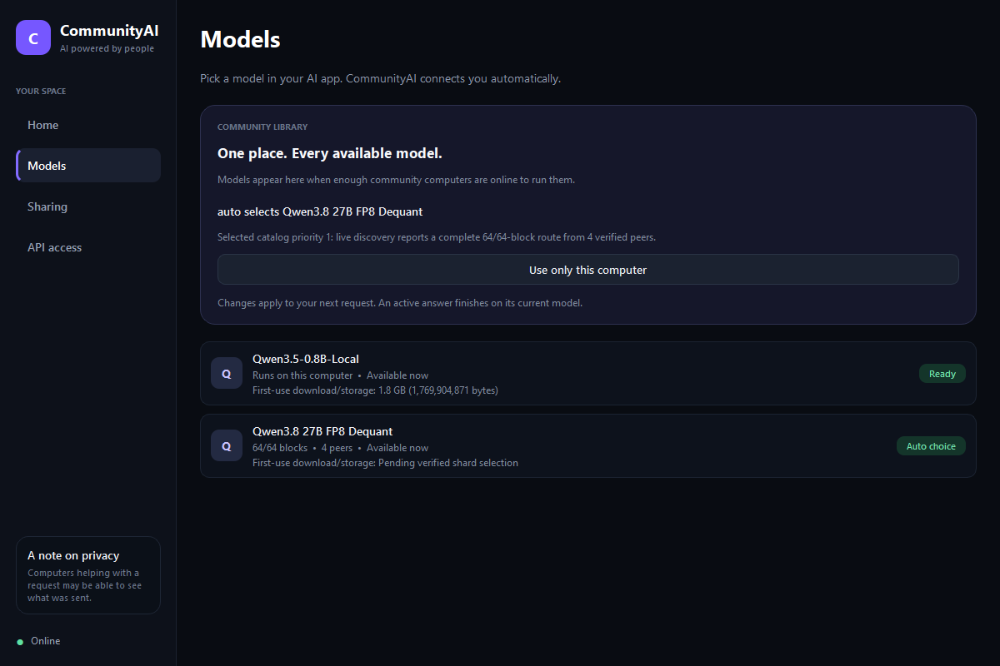

# Automatic Qwen formation test

**PASSED on GCP, 2026-09-07:** the actual `Run Qwen Formation.cmd` run
`q38af-20260907-085527-0e997a` completed all acceptance steps and verified cleanup
with exit code 0. It formed 64/64 blocks automatically, promoted and generated on
all six clients, returned local answers on five survivors, then restored all six
community answers after an unattended same-identity restart. No live code,
policy, range, catalog or service intervention was needed. Total time including
setup and cleanup: 95 minutes. [Passing evidence](evidence/qwen-formation-passed-20260907.json).

The four automatic spans were `16:32`, `48:64`, `32:48`, and `0:16`. Each real Qt
window passed Gate 13's policy Save, per-model Pause normalization and master
Start controls. Windows community requests took 30.707 seconds before loss and
29.949 seconds after recovery. The first validated local reply arrived 212.765
seconds after the kill phase began, and the first validated recovered community
reply arrived 204.508 seconds after the restart phase began. These sequential
checkpoint timings include polling and inference; they are not per-client
detection latency. The scope limits below remain in force.

**Modal currently cannot complete this test:** its sandbox filesystem rejected
the atomic settings exchange required by the production node. The real desktop's
policy Save returned HTTP 503; sharing remained disabled. All six clients had
already passed local inference and real-window selection checks. Both full Modal
attempts were cleaned. [Evidence](evidence/qwen-modal-formation-blocker-20260907.json).
The runner now checks this filesystem capability during image setup. The active
fallback is GCP N2 with actual remote Qt desktops as well.

The retained **`Run Qwen Formation Modal.cmd`** runs from the same C:
checkout. It reuses the acceptance flow below and needs an already authenticated
Modal Python (override with `COMMUNITYAI_MODAL_PYTHON`). Four CPU contributors
have 32 GiB each; a fifth client/seed has 16 GiB. Each gets two physical cores
(four vCPU threads). All five run the production Qt desktop on Xvfb. The runner
clicks the real sharing-policy Save and Start sharing controls, observes every
remote window at each model transition, and retains screenshots. Windows uses
the retained frozen node with the source Qt UI. This is not a frozen Linux
installer qualification. Raw TCP tunnels carry libp2p's own TLS; worker
`public_port` advertises the external port while its listener remains on 31330.
Only capacity and reachable endpoints are supplied, never block ranges.

Modal loss kills the complete contributor node and desktop process trees, verifies
they stopped, and restarts them on the same sandbox disk with the persisted
identity and policy. It does not claim destruction/replacement of that sandbox.
All five sandboxes have a six-hour maximum lifetime and are explicitly terminated
after diagnostic capture. Cleanup checks both sandbox exit and the app's stopped,
zero-task state. No named persistent volumes or deployed endpoints are created.
Evidence is under `.gate13-runs/qwen-formation-modal/q38mf-.../`.

Run **`Run Qwen Formation.cmd`** from the C: checkout. It accepts no arguments and
uses `config/qwen_formation.json`. It follows the Gate 13 lifecycle: new run folder,
lock, preflight, source snapshot, owned cloud resources, desktop observations,
worker loss/recovery, diagnostic capture, verified cleanup, durable result.

This test supplies **capacity, never block assignments**. Four `n2-highmem-4`
contributors each offer 16 blocks through the production node's `model: auto`
worker. An `e2-standard-4` coordinator provides the isolated discovery seed and
another client. This needs 20 GCP vCPUs; preflight checks existing quotas and does
not request increases. Hosts have an automatic deletion deadline within six hours.
The standing bootstrap VM is not a target.
The current profile uses N2 workers in `us-central1-b`, with 80 GB balanced disks.
C3 workers in `b`/`c` and an E2 coordinator in `f` encountered stockouts. All partial
attempts were cleaned up. The bounded profile also permits the original C3 workers
and zones `c`/`f` for fresh retries. Both worker types have four vCPUs and 32 GB RAM.

Each cloud participant must first expose a fresh discovery observation within
180 seconds, then generate a real local Qwen3.5 answer. Unknown coverage cannot
pass that checkpoint. Contributors
then enable sharing one at a time, waiting for fresh coverage before the next
join. The production planner selects their exact ranges and publishes signed
intents. The runner requires successive 16/32/48/64-block coverage, automatic
Qwen3.8 selection, and real three-token answers on all five cloud nodes and the
Windows client. It kills one entire contributor process group, requires local
fallback and real answers on the survivors, restarts that participant with its
existing identity/policy, then requires full coverage and Qwen3.8 answers again.
No recovery step assigns a span. Catalog sequence 2 and its measured readiness
thresholds are unchanged.

Startup follows Gate 13 literally: automatic worker startup stays enabled in the
saved config, while the initial sharing policy keeps contribution off. The real
desktop saves the policy. If that starts sharing before the explicit Start check,
the runner clicks the checked per-model sharing control to pause, waits for the
paused state, then clicks the actual master Start sharing button. This preserves
the saved startup behavior required for unattended whole-node recovery.

The Windows session uses the retained hash-verified v9 node, existing verified
model caches, and the **real production Qt window run from source**. Qt automation
uses Gate 13's existing hook to observe selection and click the actual local-only
button. It records the resulting mode, displayed selection, and screenshots.
The cloud participants run production node source and the real Qt desktop on
Xvfb, with local inference on CPU. The runner clicks policy Save and Start
sharing, observes all five remote desktops, and retains their screenshots.
The Windows local model uses the configured RTX 2070 SUPER device.

This is a **staggered formation** test. It does not certify a simultaneous cold
join burst, GPU contributors forming the whole model, a fresh installer, or the
fully frozen desktop UI. The packaged Windows participant is a client here; the
four cloud production nodes contribute. Keep those limits in any release claim.

Evidence is under `.gate13-runs/qwen-formation/q38af-.../`: `result.json`,
`qualification/run-state.json`, source bundle/hash inventory, command journal,
per-checkpoint node/worker records, desktop screenshots and `cleanup.json`.
Each command has a fresh response ID. Status must be fresh. Diagnostics failures
cannot bypass cloud cleanup. A failed preflight creates no cloud resources.
GCP authentication must already work; this runner never invokes a login flow.

`scripts/qualify_qwen_formation_local.py` exercises only the packaged local node
and real Qt controls against an empty local DHT. Its evidence explicitly says
`distributed_formation: false`; it cannot satisfy the cloud formation gate.

## Current evidence

On 2026-09-07 UTC, the first cloud attempt stopped before provisioning because native
GCP token refresh required owner reauthentication. After the owner renewed auth,
three attempts encountered regional stockouts; each verified complete cleanup.
The user requested Modal as the alternative. Its live raw-TCP nonce and cleanup
probe passed (`q38mt-20260907-053914-147072`). The first full Modal attempt
(`q38mf-20260907-054234-8995de`) was stopped after Qt reported a missing GLib
library; all five sandboxes and local processes were cleaned. The dependency and
a real-window image-build check are persisted in the runner. Its next replay,
`q38mf-20260907-054716-44636d`, passed all six local answers and UI observations,
then exposed the filesystem incompatibility described above. A new GCP N2 replay
uses the same remote desktop controls. Neither Modal attempt is a formation pass.

The local desktop harness passed. Regression tests exposed and fixed fragmented placement,
sole-provider movement on an already complete route, and placement seeds based
on installation paths rather than persistent public identities.
See [the checkpoint](evidence/qwen-formation-checkpoint-20260907.json).
The GCP N2 run `q38af-20260907-060309-6fc196` then passed all six local-answer/UI
checks and the first 16-block automatic join. It exposed a further slow-growth
defect live: after 15 minutes, the first worker abandoned unique blocks 0–15 for
16–31 while the route was incomplete. Commit `f496b8d` requires net coverage gain
before abandoning unique blocks. The new slow-growth regression failed before
the fix; 56 related tests passed afterward.
[Slow-growth evidence](evidence/qwen-formation-slow-growth-20260907.json).

The actual `.cmd` replay `q38af-20260907-064802-b6b85b` passed all six local
answers/UI checks and reached 32/64 blocks, automatically choosing `48:64` and
`0:16`. The first worker retained its unique span after 915 seconds, confirming
the slow-growth fix in this live case. The third participant still had unknown
discovery coverage; the runner crashed when comparing `null` with 32. Its live
parent stack showed an unbounded DHT readiness wait. Commit `17ffeb2` bounds that
parent wait, cleans unsuccessful starts for retry, handles unknown coverage,
and requires early discovery evidence. Both regressions failed before the fix;
72 related tests passed afterward. No runtime changes preceded this failure;
py-spy was installed afterward only for diagnosis. All owned resources and local
processes were verified cleaned.
[Discovery evidence](evidence/qwen-formation-discovery-startup-20260907.json).

The next actual `.cmd` replay, `q38af-20260907-073105-de0f20`, formed all 64 blocks
automatically (`32:48`, `48:64`, `0:16`, `16:32`). All six clients promoted under
unchanged signed sequence 2 and returned real three-token Qwen3.8 answers. Windows
also passed local-only and return-to-Auto controls. After the complete contributor
loss, all five survivors returned local answers. The first validated fallback
answer arrived about five minutes after the kill phase began; sequential checks
do not establish each client's detection latency or instant fallback.

Restart recovery did not pass: the restored node chose the missing `48:64` span
but stayed paused because the runner had saved `worker.enabled=false`. This was
a mismatch with Gate 13's policy-gated startup, corrected in `8d8fedf` using the
literal UI sequence above. Sixty related tests passed. An explicit failure marker
ended the wait; no worker was manually started and no live application code or
policy was changed. Owned resources and local processes were verified cleaned.
[Full formation/fallback and restart evidence](evidence/qwen-formation-restart-config-20260907.json).
The subsequent clean wrapper replay passed as recorded at the top of this page.
Keep this failed attempt separate from that unattended passing run.
