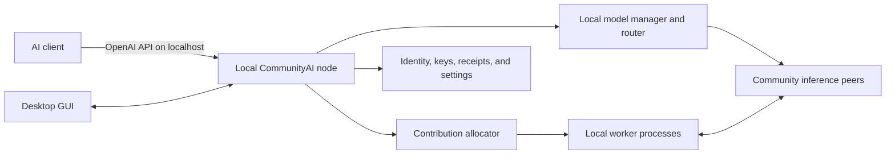

# Petals revival: public inference alpha roadmap

This repository starts from DRIFT-LLM, the most practical maintained continuation
of Petals found during the August 2026 fork audit. It preserves the parts that are
most valuable for a revival: transformer-block sharding, Hivemind DHT discovery,
fault-aware routing, heterogeneous devices, and a standard OpenAI-compatible API.

DRIFT-LLM is the implementation starting point, not the product or network
destination. CommunityAI is not intended to stop at operator-created private
clusters. Its primary goal is a shared public inference network in the spirit of
the original Petals public swarm, where independently operated machines contribute
model blocks and ordinary users can run supported models without assembling a
cluster, exchanging join addresses, or coordinating block placement. The revival
adds the product and security work needed to make that public model practical:
one-install onboarding, automatic discovery and routing, exact model identity,
artifact verification, authenticated peers, bounded contribution controls, and
recovery from untrusted or disappearing workers.

The original Petals 2.2.0 source snapshot remains separate and unchanged. The
following remotes are configured in the local revival checkout:

- `origin`: the writable [`flujo-app/CommunityAI`](https://github.com/flujo-app/CommunityAI)
  revival fork;
- `drift`: the working codebase used as our starting point;
- `upstream`: the original BigScience Petals repository;
- `nakshatra`: an active, independent llama.cpp/GGUF distributed-inference effort
  that we will track for discovery, transport, and reliability ideas.

## Autonomous execution contract

This section is the authoritative instruction for implementation work. An unattended
agent must read this section and [`RELEASE_READINESS.md`](RELEASE_READINESS.md) before
choosing work. If later historical text, an older test result, or a post-alpha design
goal conflicts with them, this section and the live readiness tracker win.

### Immediate objective

Ship a clearly labelled **public inference alpha** that real people can install and use
through a localhost OpenAI-compatible endpoint backed by public community workers. The
alpha exists to obtain real usage and reliability evidence; it is not the final credit
marketplace or the final fully independent community network.

The following owner decisions are settled and must not be reopened by an implementation
agent:

- The first release provides public inference without credits, earnings, payments, or
  payouts. Those remain post-alpha work and must not appear as available features.
- The first supported desktop and qualification matrix is Windows and Linux. macOS is
  explicitly deferred and must not be claimed as supported until later tests on real
  Apple devices pass.
- Qwen3.5 2B is the first-rung primary candidate and Gemma 4 E2B is its standby.
- GCP and Fly Machines are authorized for bounded qualification and public-alpha
  infrastructure. GCP/local hosts cover the Windows/Linux CPU/CUDA platform matrix.
  As of 2026-08-27, Fly is authorized only for the existing **CPU-only** Linux
  separate-machine recovery adapter; Fly supplies no GPU qualification capacity, and a
  Fly recovery result must never be presented as CUDA or GPU-performance evidence.
- After the first-rung alpha is stable, do not climb every intermediate model size merely
  to prove that block sharding scales. Use the accumulated Petals and
  TinyLlama/Qwen/Gemma implementation evidence to attempt a real 27-32B split route
  directly, then attempt roughly 70B if that passes. This is permission to test those
  sizes, not permission to claim that an exact larger checkpoint works before its own
  model-specific evidence passes.
- New temporary GCP and Fly test resources share one combined **USD 100 maximum**.
  Track conservative estimates and observed cost in
  [`RELEASE_READINESS.md`](RELEASE_READINESS.md). Do not start a run that could exceed
  the remaining balance.
- Use the existing `gcloud`, `flyctl`, and `gh` logins. Do not require the owner to copy
  provider tokens into environment variables when native CLI authentication works.
- On Windows, every registry token, remote credential, and Linux script must follow the
  fail-closed [Windows registry-token and remote-script boundary](QUALIFICATION_RUNNER_OPERATIONS.md#windows-registry-token-and-remote-script-boundary).
  Revalidate native auth immediately before paid creation; reject UTF-8 BOM/CRLF drift,
  recover Fly token IDs by exact unique name, revoke them in unconditional cleanup, and
  preserve Buildx state explicitly when isolating `DOCKER_CONFIG`. A source-bound remote
  registry action may use only the documented sentinel-proved protected-file transfer: verify
  a current-user-only protected Windows DACL before writing one canonical-base64 LF-only file,
  use fixed shell-free IAP SCP into one owner-only Linux staging directory, remove that staging
  before decode/login, retain no secret argv/environment/output, and require local, remote, and
  in-memory removal in same-action plus lifecycle-finally cleanup evidence.

### Public-alpha scope boundary

The alpha is an intentionally limited, best-effort public service for learning from real
users. It must be usable and honest, but it does not need to satisfy every stable-service
availability, governance, release-engineering, and adversarial-testing goal first.

The public alpha still requires:

- a non-expert Windows or Linux user can install or unpack one application, start it,
  discover public capacity, use the localhost OpenAI-compatible API, and understand when
  no route is available;
- the client automatically selects an eligible catalog model, while an opted-in
  contributor automatically selects a model and block range within the user's VRAM,
  storage, bandwidth, power, schedule, and model-policy limits;
- Qwen3.5 2B and Gemma 4 E2B pass the declared Windows/Linux CPU/CUDA qualification and
  real CPU-only separate-machine recovery gates before they are advertised as qualified;
- an alpha catalog is authenticated by at least one pinned CommunityAI release key,
  manifests and artifacts are content-verified, peer announcements are authenticated,
  public requests have finite admission/time limits, and operators can disable a bad
  route or catalog entry;
- at least one complete public candidate route plus a small standby/fallback route is
  observable from a clean packaged install; the alpha makes no production availability
  or independent-operator redundancy promise; and
- manual upgrade/reinstall and uninstall instructions work, published artifacts have
  checksums/provenance, contribution is opt-in, and prompt visibility is disclosed.

The following are post-alpha hardening, not reasons to delay first public use:

- production-SLO route redundancy, largest-worker-loss guarantees, multiple independent
  seed/mirror operators, and multi-provider outage survival;
- independent threshold catalog key holders, key-compromise/rotation drills, and
  interchangeable-mirror governance beyond the alpha's pinned signed catalog;
- operating-system publisher signing/notarization, an authenticated automatic updater,
  automatic rollback, and polished retained-data migration beyond the alpha's manual path;
- exhaustive malicious-load, Sybil/collusion, partition, herd-switching, long-soak, and
  production-style evidence-retention programs; and
- macOS, credits/payments, the compute marketplace, and larger model-ladder rungs.

This boundary does not mean "no security until later." Exact model identity, artifact
integrity, authenticated peers, bounded public request handling, authoritative local
resource limits, and a tested disable path are the minimum safety floor for an alpha that
accepts strangers.

### Model delivery decision

The normal product installs one generic CommunityAI runtime, not one application or OCI
image per model. The signed catalog approves exact manifests and supplies discovery policy;
it does not distribute weights. Each manifest pins an immutable Hugging Face revision and
the size and SHA-256 of every allowed artifact. The client or contributor downloads only
the whole upstream checkpoint files selected for its local tensors or assigned blocks,
verifies them before use, and reuses them from one persistent shared cache.

This preserves the catalog architecture: catalog signatures answer **which model/profile is
approved**, the manifest answers **which exact bytes are valid**, Hugging Face or a future
interchangeable mirror answers **where those bytes are transported from**, and the local
cache answers **which verified bytes are already present**. No mutable URL, registry image,
or transport provider becomes a trust root. The accepted decision and its whole-upstream-
shard granularity limit are recorded in
[`ADR 0003`](adr/0003-direct-manifested-artifact-delivery.md).

### Non-negotiable launch sequence

The signed catalog and product-node Gate 11 route have passed. Gate 9 is the immediate
critical path:

1. split each Windows/Linux edge measurement into resumable direct-Hub acquisition and a
   supervised steady-state benchmark from the verified persistent cache;
2. publish the four Qwen/Gemma Windows/Linux client envelopes without building or pulling a
   model-specific image;
3. pass clean packaged install and inference against a product-node route, including cache
   reuse, restart, manual upgrade/reinstall, uninstall, and retained-data choice;
4. prove automatic contribution and resource controls on real packaged Windows/Linux
   hardware; and
5. run the bounded public canary and publish the explicitly best-effort alpha.

Do not resume post-alpha redundancy, publisher-signing/updater, independent-governance, or
exhaustive hostile-network programs while an earlier alpha outcome is unfinished. Preserve
completed foundations for those programs, but do not polish them ahead of the usable path.

Missing local tooling is work to solve, not permission to skip the critical path. In
particular, an unavailable local Docker daemon, absent model snapshots, absent local
CUDA hardware, or missing local multi-machine capacity is **not** an external blocker.
Use the authorized infrastructure for its declared role: GCP/local hosts for platform
and CUDA work, and Fly only for the CPU separate-machine recovery topology. Start an
available local service, download the exact verified artifacts, or build a bounded
temporary host. Native `gcloud`,
`flyctl`, and `gh` authentication is currently available; re-check it immediately before
use rather than relying on an older evidence note.

The next external deliverable is not another image, mirror, harness, or unit-test expansion.
It is the four real Gate 9 client envelopes using the product artifact path. Supporting code
is justified only when it implements the bounded acquisition record, process-supervised
cleanup, or another concrete gap exposed by that real run.

### Execution loop

On every implementation run:

1. Inspect the worktree and recent commits. Preserve unfinished and unrelated work; do
   not reset or discard it.
2. Read the live tracker and select the earliest unfinished mandatory alpha outcome. Do
   not select post-alpha hardening merely because it has easier local software work.
3. Attempt the gate's real deliverable first. Implement the smallest code fix required
   by a concrete failure, then return to the real attempt in the same run. Do not spend a
   run adding speculative validation layers, expanding test infrastructure, rewriting
   the roadmap, or restating blockers without producing or attempting the external
   artifact, hardware result, multi-machine result, or deployment the gate requires.
4. Run verification proportional to risk. External evidence must name the exact source
   commit, model manifest, device/profile, and cleanup result.
5. Update `RELEASE_READINESS.md`, `CHANGELOG.md` when user-visible behavior changed, and
   the evidence archive when a real gate ran. Never mark a gate complete from a unit test
   when the gate requires real hardware, separate machines, public infrastructure, or a
   packaged application.
6. Commit each verified slice with a descriptive message. Push the working branch and
   open or update its pull request when the slice is ready for CI; never merge failing
   required checks or rewrite shared history.
7. Continue with the next mandatory gate. A gate is externally blocked only after safe
   authorized provisioning/tooling alternatives were attempted and failed because of a
   provider outage, expired owner login, exhausted authorized budget, unavailable owner
   credential, or another condition the agent cannot resolve. Stop only when the run
   ends, the release is complete, or that narrow definition applies to every permitted
   task on the current critical path.

### Cloud safety rules

- Before provisioning, record a conservative maximum estimate in the spend ledger and
  confirm it fits under the combined USD 100 ceiling.
- An explicit owner budget reset starts a new USD 100 accounting epoch only after every
  prior run is cleanup-proved. Preserve those historical rows as `CLEANED-RELEASED` rather
  than pretending their actual cost was zero; their maxima no longer consume the new epoch,
  and delayed observed charges remain informational.
- Tag every temporary resource with a unique run ID. Provision only exact resolved
  targets; never delete by a broad name, glob, project, application, or account scope.
- Always execute cleanup. A run is failed—not passed—unless it proves that every
  temporary resource it created was destroyed.
- Never delete or replace the existing GCP discovery peer
  `communityai-bootstrap-1`, its disk/address/identity, or an unrelated Fly application.
- If cleanup cannot be proven, stop new provisioning and report the surviving resource
  identifiers privately for recovery.
- Do not expose prompts, credentials, private paths, provider responses, or network
  endpoints in committed reports.

### Work that requires owner input

Do not block on these while another roadmap item can proceed. Ask the owner only when the
input is on the critical path:

- a provider login expires and native CLI reauthentication is required;
- the next bounded cloud run does not fit under the remaining USD 100 ceiling;
- platform code-signing/notarization credentials or a publisher identity are required;
- production catalog signing needs independent human key holders;
- an independent seed or mirror operator must accept operational responsibility; or
- an irreversible public release action has no tested rollback path.

### Public-alpha definition of done

The alpha is ready only when every required gate in `RELEASE_READINESS.md` is passed.
At minimum that means exact Windows/Linux qualification for both first-rung candidates,
real separate-machine interruption recovery, an initial complete public candidate route
and fallback, automatic client model selection, automatic contributor model/block
placement, a pinned signed catalog/bootstrap, packaged clean-install inference, enforced
local contribution limits, explicit volunteer-worker privacy disclosure, bounded public
admission, and documented manual upgrade/uninstall and route-disable procedures. The alpha
is best-effort and does not claim stable-service redundancy. Credits, macOS, publisher-signed
installers, automatic updates, independent threshold governance, and exhaustive malicious-
network qualification are not alpha gates.

## Implementation evidence snapshot (2026-08-26)

This section is historical context, not the active task queue. Current gate status and
next actions live in [`RELEASE_READINESS.md`](RELEASE_READINESS.md).

Milestones 1 through 4 are complete. The revival has exact cross-platform inference
parity, real multi-machine failure recovery, signed manifest and artifact integrity,
and a persistent multi-model local node with an authenticated OpenAI-compatible API,
supervised contribution workers, and measured edge behavior.

Milestone 5 is active. Its architectural foundation is now fixed:

- PySide 6 is the selected product shell; both spike alternatives passed packaged UI
  smokes on Windows, Linux, and macOS before the decision was recorded in
  [`ADR 0002`](adr/0002-desktop-shell-spike.md).
- The desktop remains a client and lifecycle supervisor of the standalone local node;
  model, DHT, and worker runtimes do not move into the GUI process.
- Privileged control credentials and revocable OpenAI client keys are separate
  authorization domains. An inference key cannot manage workers or keys, and the
  control credential cannot perform inference.

The shared client and acceptance contract now live in a standalone production PySide
package. Its source and packaged smokes enforce the GUI/node boundary, strict loopback
control traffic, key lifecycle, and worker controls without importing model runtimes.
The node and desktop now share the native credential store directly, and the desktop
has source-level ownership for node startup, authenticated readiness, bounded crash
backoff, reconnect, and shutdown. The production builder now also stages a separately
frozen node runtime and smokes its node and contribution-worker entry points; a packaged
Windows run joined the published DNS seed with a native credential and completed owned
shutdown. The signed-catalog path now provides independent Ed25519 keys, threshold
verification, expiry, rollback protection, an elastic capacity-ladder selector, bounded
node-side HTTPS fetching, exact manifest installation, last-known-good recovery, and
automatic seed-backed first-install configuration. The desktop invokes that work in the
separately frozen sidecar before starting a node, and the builder can stage the strict
public release input without moving trust code into the GUI. The model-agnostic
qualification path pins Qwen3 1.7B as a bootstrap evidence checkpoint with exact digest
`sha256:aef22f8678f9c5dcc5315913cf1cf584fa9e6c2fba8d064f715d78d823c9f056`; all 28
blocks passed full-artifact Windows CPU parity and two-replica selected-worker recovery.
Its cold-client Windows CPU edge envelope is also measured. That older checkpoint proves
the harness but is not a production-ladder candidate. The 2026-08-23 ladder refresh now
targets current size-specific Qwen3.5/Qwen3.8 primaries, Gemma 4 standbys through 31B,
and Llama 4 standbys for larger MoE rungs. Exact Qwen3.5 2B and Gemma 4 E2B candidate
manifests now pass full-artifact Windows CPU stock parity and two-replica interruption
recovery. A manual self-hosted workflow dispatches each declared
Windows/Linux/macOS CPU/CUDA/MPS profile by exact labels, then preflights every declared snapshot file and size, verifies the actual checkout matches
the claimed source commit, and checks the real device before any expensive model job begins.
Host readiness outputs cannot claim qualification.
Passing hosts preserve immutable qualification reports and feed one strict source/runtime
matrix. Both Windows preflight and qualification build and retain the repository-patched
Hivemind runtime after the locked dependency sync, and aggregation now uses the same locked
project environment. The workflow has not yet been run on the required hardware. A provider-neutral multi-machine controller now requires a passed
matrix with complete host evidence, two disjoint complete split routes, a fresh nonce-bound
selected-peer hard-kill acknowledgement, exact same-session stock parity, a clean
post-recovery request, an observed stopped/joined client DHT, and complete
provisioned-resource cleanup after its accepted preflight boundary. An opt-in Fly
Machines adapter now provisions one isolated bootstrap plus four exact-manifest workers,
discovers their stable public PeerIDs, generates the private topology/control inputs,
binds a selected worker to provider metadata before requesting SIGKILL, and destroys all
run-tagged Machines. Its private state journal and outer exception/SIGTERM cleanup trap
cover failures before controller preflight. The bounded report retains neither provider
commands/output, private paths, network endpoints, bootstrap addresses, nor the synthetic
prompt. The adapter and controller have not yet been exercised against the candidate
models on real separate hosts. The
repository-local publication handoff is now a deterministic,
self-verifying directory containing the exact signed catalog, bootstrap, manifests,
preflight report, and a digest index; desktop packaging revalidates and stages that
complete bundle instead of trusting a standalone report. No production bundle has been
created or published.
Multi-machine qualification, signed catalog publication, public model workers, release
bootstrap, and real packaged clean-install inference remain the immediate objective.
Contribution policies and budgets, accessibility and resource measurements, and signed
installer/update/rollback validation follow. Milestones 6 through 8 remain planned
after this desktop foundation.

The first always-on public discovery peer is now deployed as milestone 6 pilot
infrastructure. A separate Windows client reached its public IPv4 address, completed a
real Hivemind join and DHT query, and observed the same peer identity after service
restarts. This removes the immediate need for users to operate the first node, but it
does not complete decentralized discovery and does not by itself make the desktop
usable: the application can start and own its local node and now has the safe bootstrap
consumer, but a release still needs to ship the trusted root/seed input, publish the
signed model catalog, and find actual model workers.

## Scope and product destination

Public community inference is the primary product. Distributed training and
fine-tuning are compatibility features, not roadmap priorities. Near-term work
must make it easy for ordinary computers to contribute model blocks and for clients
to receive correct, streamed responses from a shared public network.

The long-term product is one installable desktop application. A user starts the
application, points an AI client at a stable localhost OpenAI endpoint, and chooses
a model from a signed community catalog. By default, the application discovers the
public community swarm, calculates and repairs its own route, and streams the
response directly through independently operated workers without depending on an
operator-owned inference gateway. The user does not need to create a swarm, run a
bootstrap node, find peers, or assign model blocks. The same installation may
contribute compute to that public network in the background when the user opts in.



"One application" means one installer, one lifecycle, and one coherent GUI. It
does not require inference, networking, and GPU work to share one operating-system
process. Those components should remain supervised and isolated so that a crashed
worker cannot take down the local API or corrupt the UI.

The GUI must let a non-expert:

- create, revoke, copy, and label keys for the localhost API, and securely store
  model-provider credentials such as a Hugging Face token;
- see model availability, route health, download state, request activity, and the
  exact localhost URL and model names to give an AI client;
- enable or pause contribution, set an absolute or percentage VRAM budget, and set
  storage, bandwidth, power, schedule, and thermal limits;
- allow, prefer, or forbid models and model families. A local restriction is a hard
  constraint: automatic allocation must never override it;
- see estimated, pending, and settled contribution credits separately, including
  enough receipt detail to explain changes without exposing prompt contents; and
- understand that public workers process request-derived data and must be assumed
  capable of observing or retaining it.

The public community network is the product destination and, once its release gates
pass, the intended default experience. Private and VPN swarms remain supported as a
secondary mode for organizations or groups where every participant is trusted; they
are not the end goal inherited from DRIFT-LLM. Using private swarms as the current
validation baseline is a safety measure while the minimum public-network identity,
discovery, abuse-resistance, and usability gates are completed. Full independent
redundancy remains stable-service hardening.

## Architectural baseline and gaps

The current DRIFT-derived code is decentralized within a configured model swarm,
which makes private clusters a useful implementation baseline. The gap this roadmap
must close is turning that baseline into the intended autonomous, easy-to-join public
community network:

- Workers publish expiring layer announcements into a Hivemind DHT. Each client
  reads those records and chooses its own latency- or throughput-aware route. The
  bootstrap peer is an entry point, not a scheduler.
- The friendly `drift up` flow normally gives newcomers one first-node join address.
  One public pilot seed now supplies that first address, and multiple initial peers
  are supported, but the application does not yet ship the seed automatically.
  Redundant independent discovery, remembered peers, and recovery when every shipped
  seed is unavailable are not yet productized.
- `drift api` already binds to `127.0.0.1` by default and performs client-side swarm
  routing, but it serves one model per process and is separate from `drift up`.
- A worker operator chooses the model out of band. DRIFT automatically chooses the
  number and range of blocks within that model; it does not choose between models.
- Model DHT names are generally derived from a repository name, sometimes only its
  basename. Announcements do not bind a route to one exact repository revision,
  tokenizer, runtime profile, or weight manifest. That is unsafe for an untrusted
  multi-model public network.
- The client keeps input embeddings, final normalization, and the language-model
  head locally. This is much smaller than the full model but can still impose
  meaningful RAM, disk, download, and CPU costs on a thin edge device.
- There is no contribution-credit protocol, settlement ledger, community model
  governance, or automatic cross-model allocation today.

These gaps determine the order of the roadmap. A GUI must control a stable local
node service; it must not become the place where networking, identity, and credit
rules are improvised.

## Decentralization model

The target is public community inference across independently operated, mutually
untrusted nodes, while minimizing concentrated authority and eliminating central
services from the inference hot path. Joining that network must feel like using a
local application, not operating a distributed system. It is not credible to promise
that a fresh installation can discover a global network with no prior information or
trust, so each installation needs at least a trusted application build or catalog
root and one reachable way to learn about peers.

The target design is:

- **Local inference gateway.** Every application exposes its own localhost OpenAI
  endpoint and routes directly through the swarm. A hosted gateway may exist for
  convenience, but normal desktop use never depends on it.
- **Interchangeable discovery.** Ship several independently operated bootstrap and
  relay peers, accept user-supplied peers, remember previously verified peers, and
  use LAN discovery where available. Bootstrap peers introduce nodes; they do not
  select models, approve requests, hold balances, or route inference.
- **Content-addressed model identity.** Derive the swarm namespace from a canonical
  model manifest, not a mutable name. Pin full model revisions and hash the config,
  tokenizer, chat template, weight inventory, runtime compatibility, precision and
  quantization profile. A worker with a different manifest is a different swarm.
- **Local policy and worker sovereignty.** Every node independently decides whether
  and what to host inside the user's resource and model restrictions. No remote
  scheduler can allocate a user's GPU.
- **Forkable trust.** The application may subscribe to one or more signed community
  catalogs. Catalogs recommend compatible manifests; they do not prevent users from
  adding another catalog or an exact manifest. Use threshold signatures and key
  rotation so no single maintainer key can silently redefine an approved model.
- **No blockchain in routing or model selection.** The DHT is an expiring discovery
  store, not a historical ledger. It must not be treated as a balance database or a
  voting system. Blockchain is considered only if credits eventually require open,
  transferable, trustless settlement and a federated design cannot meet the threat
  model.
- **Explicit residual dependencies.** Model artifacts come from pinned Hugging Face
  revisions and persistent verified local caches. Clients and contributors select only
  the upstream checkpoint files required by their local tensors or assigned blocks.
  Content-addressed mirrors and peer-assisted distribution may be added later, but every
  transport remains replaceable and subordinate to manifest verification.

No single bootstrap, catalog mirror, health dashboard, hosted API, or credit node
may have unilateral control over inference. Catalog signing and credit settlement
are separate trust domains and stay off the token-generation critical path.

## Security and privacy objectives

A public swarm must assume that its DHT, relays, artifact hosts, catalog mirrors,
workers, clients, and future accounting participants can fail independently and that
some of them may be malicious. CommunityAI must not obtain safety merely by replacing
the old Petals services with one new trusted coordinator. Clients validate identities,
records, manifests, and artifacts locally, and security-sensitive inputs fail closed
when they are malformed, stale, unsigned, downgraded, or inconsistent.

The major security outcomes are:

| Threat or boundary | Intended protection | Current state and public-release work |
| --- | --- | --- |
| Network interception or an untrusted relay | Manifested client-to-worker RPC uses libp2p TLS 1.3 and connects to an authenticated PeerID. Relays may forward the encrypted connection but do not receive its plaintext. | Implemented for manifested swarms. Public qualification must continue to reject plaintext or unauthenticated transport profiles and test direct plus relayed paths. |
| Forged, copied, or stale DHT records | The DHT is only an untrusted carrier. Worker announcements and intent leases bind the public key, PeerID, exact manifest, execution profile, block range, lifetime, and monotonic sequence in a signed envelope. Clients reject bad signatures, copied block records, expiry, replay, equivocation, and revoked identities before routing. | Worker announcements, rotation, successor revocation, replay guards, and RPC identity comparison are implemented in [`Public swarm security v1`](PUBLIC_SWARM_SECURITY_V1.md). Catalog-authority revocation and public key-compromise drills remain release work. |
| Model substitution or poisoned artifacts | A content-derived `ModelManifest` pins the full upstream revision, tokenizer, chat template, execution profile, and complete weight inventory. Configuration and every required weight shard are checked by size and SHA-256 before parsing or deserialization; partial downloads remain unusable until atomically verified. | Implemented and validated against tampered metadata, poisoned weights, interrupted downloads, and exact stock-model parity. Public catalogs still need qualified production manifests and interchangeable artifact origins. |
| Compromise of one catalog key or mirror | Model approval is separate from worker identity. Catalogs use independent Ed25519 keys, configurable signature thresholds, expiry, sequence-based rollback protection, exact manifest digests, and interchangeable HTTPS mirrors. Installations retain their own trust root and may select a different compatible catalog. | The format, verifier, selector, first-install consumer, and last-known-good recovery are implemented. Alpha requires one pinned release signer plus expiry/rollback checks; independent threshold holders, compromise/rotation drills, and alternative-catalog interoperability are stable-service gates. |
| Tampered application or unsafe update | Release artifacts must publish checksums/provenance and the application must never install an untrusted update silently. Stable releases additionally use platform-verifiable publisher signing, authenticated update metadata, downgrade protection, and tested automatic rollback. | Current desktop bundles are unsigned engineering evidence. Alpha requires clean install, manual upgrade/reinstall, uninstall, checksums/provenance, and recovery instructions on Windows/Linux. Publisher signing, an automatic updater, update-key governance, and automatic rollback are post-alpha hardening. |
| Local credential theft or privilege confusion | The node binds to loopback by default. Revocable OpenAI client keys authorize inference only; a separate privileged control credential manages workers and keys but cannot perform inference. Desktop-owned control credentials live in the native OS credential store and are not passed in commands, environment variables, logs, or ordinary configuration. | Authority separation, 256-bit client keys, immediate revocation, one-time secret display, native credential ownership, and authenticated node lifecycle are implemented. Packaged credential-store validation on Windows/Linux remains an alpha gate; publisher-signed installers and macOS validation follow the alpha. |
| Discovery, telemetry, or accounting leaking request content | DHT records contain routing and capacity data, not prompts. Demand signals must be coarse, short-lived aggregates, and future receipts must exclude prompts, generated text, hidden states, logits, API keys, and per-user request histories. | This is a protocol and data-minimization requirement. Signed demand aggregation, privacy review, retention limits, receipt implementation, and tests proving that content cannot enter observability or accounting records are still required. |
| Worker loss, compromised infrastructure, or denial of service | Clients route directly, use finite timeouts, exclude failed identities, replay bounded activation history when a replacement exists, and do not require an operator gateway. Multiple independent seeds, mirrors, and routes are the stable-service availability target. | In-generation worker-loss recovery is implemented and has passed real multi-machine parity tests. Alpha still requires finite admission/rate limits, a route-disable drill, honest unavailable status, and a bounded canary; regional redundancy, partitions, hostile-load campaigns, and independent-provider outage survival are post-alpha. |
| A public signal coercing or exhausting a contributor | Contribution is opt-in and local policy is authoritative. The network must not override model allow/deny rules, force an unapproved download, exceed storage/VRAM/bandwidth/power limits, or keep resources after the user pauses sharing. Worker processes remain supervised separately from the desktop and local API. | Worker supervision exists. Hard budget enforcement, download authorization, sandbox/containment review, pause-time guarantees, and adversarial resource-exhaustion tests remain milestone work. |

Signatures, hashes, and TLS address different threats. Signatures authenticate who
published a record; hashes prove which bytes were selected; TLS protects those bytes
and request-derived tensors while they travel between authenticated endpoints. None
of these alone proves that a remote worker runs honest code, reports honest capacity,
or deletes data after processing it. Runtime attestation, measurement, admission,
rate limits, Sybil resistance, and receipt validation are separate controls and must
not be represented as consequences of transport encryption.

### Privacy boundary

CommunityAI preserves Petals' valuable decentralized data path and makes it the
default product boundary: the OpenAI endpoint, routing decision, input embeddings,
final language-model head, and sampling stay on the user's machine. Bootstrap nodes,
catalog mirrors, relays, health services, and accounting services are not in the
inference plaintext path. No single hosted gateway receives every prompt, and
discovery and future accounting data are deliberately separated from prompt and
generated content.

This is not end-to-end confidential inference against the selected workers. A worker
must decrypt and process the request-derived activations for the blocks it serves.
Those activations can reveal information about the request, and a malicious worker
may inspect, analyze, or retain them. TLS prevents passive network observers and
relays from reading the connection; it does not make the serving worker blind. The
network also does not currently provide sender anonymity: peers and relays may observe
connection metadata such as addresses, timing, and traffic volume.

The public application must therefore warn users before first use and provide a
persistent explanation of this boundary. Sensitive workloads should use a private or
VPN swarm of trusted workers unless a separately specified and validated confidential-
execution design is available. Any future thin-edge mode that moves embeddings, the
language-model head, or sampling to remote peers expands the privacy boundary and
requires an explicit protocol decision, threat model, user disclosure, and parity and
privacy tests. It must never be presented as equivalent to the current local-head path.

The public-network privacy goal is consequently precise rather than absolute: encrypt
request-derived traffic in transit, authenticate every endpoint used for computation,
keep content out of discovery and accounting systems, minimize retained metadata, avoid
a central prompt-processing gateway, and tell users honestly which selected workers
can still observe request-derived data.

## Pilot discovery deployment

The first operator-owned bootstrap is running in Google Cloud project
`community-ai-506321`. It is deliberately a lightweight discovery peer: it introduces
Hivemind participants and supports reachability checks, but it serves no model blocks,
receives no prompts, selects no routes, and has no Google Cloud API identity.

| Property | Deployed value |
| --- | --- |
| VM | `communityai-bootstrap-1`, `e2-micro`, `us-central1-a` |
| Storage | 20 GB standard persistent disk with 2 GB local swap |
| Network | Dedicated VPC, Standard Tier, static IPv4 `35.209.21.129` |
| Public ingress | TCP 31337 only; SSH is restricted to Google IAP |
| Peer address | `/ip4/35.209.21.129/tcp/31337/p2p/QmZhGcSVR6qPLZTq3TJPZEi734GbMkouv3kPxQLdDY2qUo` |
| Published DNS | `bootstrap.communityai.flujo.com.co` A record to `35.209.21.129` |

The static IPv4 makes dynamic DNS unnecessary and keeps the peer reachable by
IPv4-only contributors. The VM and disk fit the Google Cloud Free Tier when that
billing account's monthly allowance is otherwise unused. The in-use IPv4 is billed
at USD 0.005 per hour, or about USD 3.65 for a 730-hour month, and outbound traffic
beyond the applicable free allowance is also billable. Current limits and prices are
defined by the [Google Cloud Free Program](https://docs.cloud.google.com/free/docs/free-cloud-features)
and [VPC network pricing](https://cloud.google.com/vpc/network-pricing).

On 2026-08-22, external validation proved TCP reachability from a residential IPv4
connection and a real Hivemind client join and query. The systemd service starts at
boot, runs as an unprivileged user, preserves its private identity with owner-only
permissions, and retained the PeerID above across restarts. Reproducible deployment
sources and the live inventory are in [`deploy/gcp/`](../deploy/gcp/README.md).

This node is a bootstrap dependency, not a centralized inference service. Its DNS A
record is published; the next deployment gate is automatic desktop seed configuration.
Before a stable-service release, at least one independently operated seed must be added and
the fresh-install, cached-peer, seed-loss, partition, and recovery paths must pass without
this Google VM being a single point of failure. The alpha may use the published seed as a
declared availability dependency, but must fail clearly when it or all remembered peers are
unavailable.

## Autonomous community model placement

The existing Petals/DRIFT balancing algorithm solves placement only after a model
has been chosen. Community mode needs a higher-level allocator that chooses a model
and then delegates block placement to the existing algorithm.

### Elastic model ladder

Small checkpoints are bootstrap and test rungs, not the distributed network's product
ceiling. Community `auto` selection should move monotonically toward larger qualified
models as measured capacity grows: approximately 1-2B, 3-4B, 8B, 27-32B, 70B, and
400B-plus. Each rung approves exactly one primary and at least one standby so the
catalog can replace a model without requiring both alternatives to fragment live VRAM.

These are catalog capacity classes, not a mandatory sequential qualification staircase.
The original Petals demonstrations and successful TinyLlama, Qwen, and Gemma bring-up
make larger block-sharded inference plausible enough to test directly. They do **not**
prove that an exact 30B or 70B checkpoint is compatible, fits the intended worker/client
memory envelopes, recovers correctly, or performs well enough to use.

The first post-alpha scaling experiment should therefore use an exact 27-32B candidate
split across independent workers, with no worker required to hold the full model. If one
complete block fits the target worker envelope and that run passes manifest/artifact
checks, stock parity, two complete routes, selected-worker interruption, client and
worker memory limits, TTFT, and decode throughput, proceed directly to an exact roughly
70B candidate. Test a smaller intermediate rung only when it is a useful product fallback
or helps diagnose a concrete failure; do not spend milestones on 4B -> 8B -> 12B merely
as confidence-building prerequisites.

At INT8, two complete weight replicas require roughly two bytes of aggregate usable
VRAM per parameter: 10 GB for a 5B model, 60 GB for a 30B model, 140 GB for 70B, and
810 GB for 405B before KV-cache, activation, framework, churn, and migration headroom.
Promotion is never inferred from that aggregate alone. The selector requires minimum
per-block replica coverage, independent complete routes, survival after the largest
peer loss, a stability soak, fresh observations, and measured latency and throughput
limits. Total parameters determine MoE storage; active parameters describe per-token
compute and do not make the other expert weights disappear.

The first candidate ladder and the implemented signed format are specified in
[`MODEL_CATALOG_V1.md`](MODEL_CATALOG_V1.md). The local selector may resolve an `auto`
request to the highest eligible exact manifest, but it never changes an explicit model
selection or an in-flight request. Catalog fetching, DHT-derived observations, staged
worker migration, fallback, and automatic alias updates remain integration work.

### Canonical model manifest

Define a versioned `ModelManifest` containing at least:

- a human-readable name and OpenAI API aliases;
- the upstream repository plus an immutable full revision;
- hashes and sizes for the configuration, tokenizer, chat template, weight index,
  and any converted or quantized artifacts;
- architecture, number of blocks, context limits, license and gated-access
  requirements;
- the supported DRIFT protocol/runtime range, tensor schema, attention behavior,
  dtype, quantization and adapter profile; and
- a manifest digest from which all DHT keys and protocol namespaces are derived.

The first protocol exchange must compare manifest digests. A client or worker must
reject a same-named peer with different weights or an incompatible execution
profile instead of merely warning about it.

Manifest loading is selective at whole-file granularity. The checkpoint index maps local
client tensors or assigned transformer blocks to upstream weight files; only that file set
is downloaded and verified. If required and unrelated tensors share one upstream shard,
the whole shard is still required. A future tensor-range format needs independently signed
range digests and cannot be inferred safely from safetensors offsets alone.

### Distributed capacity and demand signals

Nodes publish signed, expiring leases describing current and intended block ranges,
measured throughput, reachable addresses, cache headroom, and bounded resource
capacity. Local routers publish coarse, short-lived demand and failure aggregates;
they never publish prompts, generated text, API keys, or per-user request histories.

Demand records are hints, not authority. The design must account for spam, Sybil
identities, dishonest throughput claims, replayed leases, and an attacker trying to
pull all volunteers toward one model. Measurements from completed routes and active
probes should carry more weight than self-reported capacity.

### Local allocation policy

Each application filters candidate manifests through hard local constraints:
model allow/deny rules, license acceptance, available accelerator support, VRAM,
storage, bandwidth, power schedule, and minimum local reserve. It then calculates a
local utility approximately shaped by:

```text
coverage deficit * observed demand * useful local throughput * reliability
--------------------------------------------------------------------------
             download + switching + energy + fragmentation cost
```

The formula is a policy input, not a network consensus value. Eligible nodes make a
weighted, node-specific randomized choice so they do not all select the same model
from the same snapshot. Before downloading weights, a node announces an expiring
intent lease. Minimum residency times, switching penalties, random jitter, cooldowns,
and hysteresis prevent oscillation and download storms. A node may partition its
budget across models only when doing so improves complete redundant routes rather
than leaving unusable fragments.

Placement cost includes cache affinity: already verified selected shards reduce download
cost, while switching to an uncached model must account for exact selected-file bytes,
bandwidth limits, storage headroom, and the value of cache entries that eviction would lose.
Remote demand remains too weak to override these local costs or force a download storm.

Within the selected model, the current throughput-aware contiguous block allocator
remains the starting point. It must be extended to target minimum replica counts,
queue pressure, cache capacity, geographic/network diversity, and graceful handoff
before a node abandons a scarce range.

This is how the community chooses models: compatible manifests enter catalogs,
real client demand creates pressure, and autonomous volunteers respond within their
own policies. It is not a global poll, a maintainer command, or token-weighted
governance. Different catalogs or communities may legitimately support different
model sets on the same protocol.

Before stable-service deployment, build a deterministic simulator for thousands of nodes,
hardware profiles, model preferences, demand shifts, network partitions and churn.
Promotion requires convergence without synchronized switching, sustained end-to-end
coverage, and recovery when a popular model or region suddenly loses capacity.

## Unified local API and edge operation

The existing OpenAI-compatible server is the correct starting point for the desktop
data path. Move it behind a persistent local node daemon and evolve it into a
multi-model manager:

- expose a stable endpoint such as `http://127.0.0.1:8080/v1`, bind to loopback by
  default, generate a local key during onboarding, and require an explicit secured
  opt-in before listening on a LAN interface;
- make `/v1/models` report community models with complete usable routes separately
  from known, downloading, degraded, and unavailable models;
- honor the OpenAI request `model` field, resolve aliases to exact manifest digests,
  lazily load and cache model-specific local components, and never silently replace
  a requested model with another manifest;
- keep routing and failover local. The API process asks its own DHT view for a route
  and connects to serving peers; it does not forward prompts to a central API;
- supervise an optional local worker independently. A node may use community routes
  while contributing different blocks or a different allowed model; and
- expose a versioned, authenticated local control API for the GUI, CLI, diagnostics,
  service manager, and tests rather than letting the GUI manipulate worker processes
  directly.

"Edge device" requires a measured definition. Today the client still loads the
embeddings and language-model head. For every candidate model, publish a first-acquisition
record for selected-file download and disk cost plus a steady-state verified-cache envelope
for peak RAM/VRAM, first-token latency, and token generation. Run the measured runtime in a
fresh supervised child so process-tree exit, not allocator-specific in-process RSS return,
is the authoritative memory-cleanup boundary. If that is too heavy for the supported edge class, prototype an
OpenAI-only thin mode in which input embeddings and the final head/sampling stage are
addressable remote roles. Preserve the current local-logits mode for research users.
Thin mode changes privacy, trust, sampling flexibility, failure recovery and traffic,
so it requires a protocol decision and parity tests rather than being hidden inside
the GUI milestone.

## Identity, keys, accounting, and credits

The application creates a long-lived node identity on first run and stores private
material in the operating system credential store where possible. Local API keys,
community identity keys, provider tokens, catalog trust roots, and future credit
credentials are distinct key classes with separate rotation and export policies.
The GUI must not display private keys by default or write them to ordinary config
files.

Contribution accounting starts with signed usage receipts, not a cryptocurrency. A
receipt should identify the exact model manifest, session/request nonce, serving
peer, verified block range, measured block-token work, time window, and applicable
protocol version. It contains no prompt, generated text, hidden state, or raw logits.
Client and worker signatures alone do not prevent collusion, fabricated traffic, or
Sybil farming, so receipt validation must use route observations, replay protection,
rate bounds, and independent sampling or attestation where practical.

Credits have three states in the product:

- **Estimated:** local measurements that are useful immediately but not spendable;
- **Pending:** signed receipts awaiting independent validation and settlement; and
- **Settled:** accepted by the selected accounting trust model and safe to spend.

A DHT cannot securely settle scarce balances because it has no permanent ordered
history and cannot prevent rollback or double-spending. Before credits affect access,
choose and document one of these settlement models:

1. a single operator ledger, which is easiest but conflicts with the decentralization
   goal and is acceptable only for an explicitly temporary pilot;
2. a federated quorum of independently operated notaries with replicated state,
   threshold decisions, audit exports, and no single writer, which is the preferred
   design to prototype; or
3. a public blockchain or other permissionless settlement rail, only if credits must
   be transferable and trustless enough to justify its cost, privacy impact, latency,
   governance, and operational complexity.

Run shadow accounting first: create and validate receipts, show them in the GUI, and
compare them against independently measured work without granting or denying service.
Only after adversarial and privacy review may settled credits grant bounded access.
Settlement outages must not interrupt in-flight inference; offline authorization and
reconciliation behavior must be explicit and bounded.

Credits are for contribution and access accounting. They are not votes over which
model a user's machine must host, and the roadmap does not introduce mining,
proof-of-work, staking, or blockchain consensus into inference routing.

### Compute marketplace and provider payouts

The commercial objective is a marketplace for verified compute, not an exchange
for a speculative network currency. Buyers may purchase the right to consume
compute, contributors may earn money for independently validated useful work, and
the marketplace may retain a disclosed fee from each settled transaction. The
initial product must not permit users to trade a floating-price credit among
themselves or present credits as an investment.

Keep economically different balances separate even if the GUI presents them in one
account view:

- **Compute credits** are purchased by a buyer and spendable only on network
  inference. They are not withdrawable or transferable between users.
- **Provider earnings** arise only from settled receipts for useful work funded by a
  valid buyer authorization. They may become withdrawable after fraud, dispute, and
  chargeback holds.
- **Promotional credits** are grants, test funds, or incentives. They are never
  transferable, withdrawable, or convertible into provider earnings through a
  related account.

The intended flow is buyer funding, bounded spend authorization, routed inference,
signed per-worker receipts, independent validation, settlement, division into
provider earnings and a marketplace fee, and batched payout. A single request may
cross several workers, so the system aggregates micro-settlements rather than
attempting a card, bank, or chain transaction for every block invocation. Quotes and
authorizations bind the model manifest, measured work unit, price, currency, service
quality terms, expiry, settlement domain, and fee schedule. A nominal credit must
not imply that unlike work across different models, hardware profiles, or service
levels has identical cost.

Settlement uses an auditable double-entry ledger with explicit entries for buyer
funding, authorization holds, receipt settlement, provider payables, marketplace
revenue, reserves, refunds, disputes, chargebacks, withdrawals, and reconciliation.
Payment credentials and legal identity remain outside the inference protocol and
are not revealed to serving peers. Inference already in flight does not depend on a
payment processor or marketplace being online.

No provider earns withdrawable value for uptime, advertised capacity, self-reported
throughput, or an unvalidated client signature. Validation must detect fabricated
jobs, replay, circular spending, related-account cash-out, Sybil farming, collusion,
and wash activity. Buyer funds must be final enough for the applicable risk policy
before provider payout, and new or anomalous accounts may require limits, reserves,
delayed withdrawals, or additional verification. Promotional activity must be
excluded from cash settlement by construction.

The official marketplace is a replaceable service built on the open receipt and
settlement protocols, not a mandatory toll in peer discovery or inference routing.
Nodes may select another compatible settlement domain, and a marketplace earns its
fee by providing buyer access, matching, reputation, validation, dispute handling,
and payouts. An unavoidable operator fee embedded in every network interaction
would create a central control point and would not be credible in a forkable system.

Before accepting fiat or enabling withdrawals, resolve merchant-of-record and loss
liability, seller onboarding and identity verification, sanctions and abuse checks,
tax reporting, refunds and chargebacks, privacy, and the money-transmission,
stored-value, labor, and crypto-asset classifications in every launch jurisdiction.
Use a licensed marketplace payment and payout provider for the first production
version where available; do not custody customer fiat or improvise cross-border
payouts in the node software. Freely transferable or externally tradable credits,
an order book, and any public token require a separate architecture decision,
specialist legal review, adversarial economic analysis, and an independently audited
implementation.

## Milestones

1. **Reproducible execution baseline — complete.** Native Windows, Linux,
   and macOS setup; local DHT smoke test; exact token parity with a stock model; CPU
   and accelerator diagnostics. Windows CPU, Linux CPU, Windows CUDA, and a native
   hosted Apple Silicon macOS run are proven on an eight-block TinyLlama swarm; the
   macOS matrix also passes the MPS block-portability checks.
2. **Real multi-machine swarm — complete.** Two or more machines, explicit block
   coverage, restart testing, disconnect recovery, and latency/throughput
   measurements. A private Fly Machines swarm has proven coverage, redundancy,
   exact parity, measurements, restart recovery, and in-generation recovery. During
   a 900-token request, the selected `4:8` Machine was killed with SIGKILL; the
   client excluded its stale route, replayed 249 cached activation tokens through
   the duplicate in bounded chunks, and completed with exact stock-model parity. A
   subsequent request confirmed that the survivor's attention cache was released.
3. **Public protocol identity and content integrity — complete.** Specify `ModelManifest v1`
   and content-derived DHT namespaces; pin exact model revisions; sign and validate
   worker identity, announcements, intent leases, and execution profiles; reject
   manifest mismatches; authenticate and encrypt transport; define key rotation and
   revocation; and preserve an explicit legacy/private namespace during migration.
   Private/VPN swarms remain the deployment default until this milestone and the
   public safety gates pass. That is a rollout precaution, not the product destination;
   the intended release experience is the shared public community network.

   The first identity slice is implemented: the strict
   [`ModelManifest v1`](MODEL_MANIFEST_V1.md) schema has deterministic SHA-256
   identities and content-derived DHT namespaces; worker and API loading pin the
   repository revision and execution profile; clients filter mismatched DHT records;
   and both sides compare the digest during RPC setup and compute requests. Legacy
   private prefixes remain available when no manifest is supplied. The artifact
   integrity slice is also implemented: reproducible generation resolves Hub revisions
   to full commits; API and worker loading verify declared config, tokenizer, index and
   only the checkpoint shards they actually need before parsing or deserialization;
   undeclared or poisoned files fail closed; and checked-in canonical vectors pin the
   digest contract. Native Windows and a real multi-Machine Fly Linux swarm have both
   passed manifested exact-parity loading, and a poisoned Fly worker was rejected
   before it could announce blocks. The security slice is now implemented as
   specified in [`PUBLIC_SWARM_SECURITY_V1.md`](PUBLIC_SWARM_SECURITY_V1.md):
   persistent libp2p identities sign complete, expiring worker announcements;
   clients bind their manifest, execution profile, block range, revocation state,
   replay order, and RPC PeerID to that signature; manifested transport explicitly
   requires libp2p TLS 1.3; and signed intent leases, dual-signed rotation, and
   successor revocation share the same strict envelope. Interrupted artifacts resume
   into a locked private partial and are atomically promoted only after size and
   SHA-256 verification. A real Hub test resumed TinyLlama at byte 2,097,152 with
   HTTP 206, and signed Windows CPU parity plus in-generation failover passed. The
   signed Fly rerun then routed across independent `0:4` and `4:8` identities and
   passed exact parity. A hosted Apple Silicon macOS run then generated the pinned
   manifest, resumed a real Hub artifact at byte 2,097,152 with HTTP 206, served all
   eight blocks through a signed manifested identity, and matched the stock token
   output exactly. This closes the milestone's cross-platform validation gate.
4. **Unified local node and multi-model OpenAI API — complete.** Introduce the persistent node
   daemon, worker supervision, a versioned local control API, multi-model discovery
   and lazy client loading, a stable localhost OpenAI endpoint, local API-key
   lifecycle, route/coverage status, bounded concurrency, and clean shutdown. Measure
   the current client-side embedding/head cost and decide the thin-edge protocol.
   Validate compatibility with representative OpenAI clients before adding a GUI.

   The first vertical slice is implemented according to
   [`ADR 0001`](adr/0001-unified-local-node.md): `drift node` owns a stable,
   authenticated loopback API; registers one exact manifest; lazily and safely loads
   its client runtime through a thread-safe model manager; resolves manifest names,
   API aliases, and digests without fallback; reports versioned authenticated status;
   generates a persistent local key when needed; refuses accidental non-loopback
   binding; and cleans up the client route manager and DHT on shutdown. The existing
   single-model `drift api` surface now uses the same selection path and rejects a
   mismatched request model.

   The second slice adds strict secret-free
   [`NodeConfig v1`](NODE_CONFIG_V1.md), bounded
   runtime residency, request-scoped leases, least-recently-used idle eviction,
   authenticated safe unload, and coverage observations from loaded route managers.
   An HTTP cancellation cannot release or evict a runtime while its executor thread
   is still generating.

   The final slice adds artifact-free, manifest-bound coverage discovery for every
   configured model; isolated contribution-worker processes with observable restart
   backoff and authenticated start, pause, and restart controls; persistent labeled
   API-key creation, listing, relabeling, and revocation with hash-only storage; and a
   reproducible cold-client benchmark for cache growth, local embedding/head
   weights, process-tree RAM/accelerator use, load time, first-token latency, and
   decode rate. A real Fly
   swarm exposed two distinct manifests through one restarted node. The official
   OpenAI Python client listed and generated from both, streamed a completion, reused
   the persistent key after restart, and proved one-runtime LRU eviction plus exact
   stock-model token parity. Unloaded discovery observed complete `8:8` external
   routes without loading either client runtime. The measured TinyLlama CPU client
   used 16,384,000 bytes for local embedding/head parameters and 11,773,110 bytes of
   cold cache growth; this model fits the current local-logits edge design, while
   larger selectable models still require their own published measurements.
5. **Desktop application and contribution controls — in progress.** Build the selected
   PySide desktop and ship alpha packages for Windows and Linux; complete
   first-run onboarding; manage keys in native credential stores; show endpoint, model,
   route and contribution health; enforce VRAM/storage/bandwidth/power/schedule budgets;
   implement model allow/prefer/deny policy and automatic model/block allocation; pause
   safely; support manual upgrade/reinstall and uninstall; and clearly disclose prompt
   visibility. Publisher-signed installers, automatic updates/rollback, macOS, and stable-
   service accessibility/release polish follow the alpha. The completed implementation
   spike compared a Python-native Qt/PySide shell with a webview shell and considered
   process isolation, installer/update signing, tray and service integration,
   accessibility, bundle size, and cross-platform CI.

   **Completed foundation.** The shell comparison and its fixed acceptance criteria
   are tracked in [`ADR 0002`](adr/0002-desktop-shell-spike.md). All six clean Windows,
   Linux, and macOS package/UI-smoke jobs passed. PySide 6 is selected for product
   implementation because it has the more consistent cross-platform runtime and avoids
   pywebview's 948 MB Linux Qt bundle and additional JavaScript bridge. The pywebview
   prototype remains evidence, not a second product frontend.

   The first production security prerequisite is also complete: managed OpenAI client
   keys authorize only `/v1/*`, while a distinct privileged control credential
   authorizes only `/control/v1/*`. Headless nodes generate separate private files,
   startup rejects missing, duplicate, or overlapping control keys, and upgraded
   installations retain their existing client key while receiving a new control key.

   The first product slice is also complete in [`desktop/`](../desktop/README.md). It
   promotes the shell-neutral client and acceptance contract into a PySide-only package,
   adds create/relabel/revoke key management, preserves worker controls and privacy
   disclosure, disables redirects and environment HTTP proxies for privileged control
   traffic, and has an automated source gate forbidding `drift`, Torch, Transformers,
   Hivemind, and Accelerate imports. The redesigned product surface now has Home, Models,
   Sharing, and API-access views; peer and optional region summaries; direct model
   selection; a saved GPU-memory target; and plain-language status and privacy copy.
   Existing headless credentials migrate into the native store automatically, missing
   credentials and node failures render inside the application instead of terminating
   before Qt starts, and the Windows build uses the GUI subsystem without a console
   window. The production workflow passed its unsigned runtime, authenticated-contract,
   connected-UI, and onboarding-UI smokes on clean Windows, Linux, and macOS runners.

   The second product slice is implemented at the source boundary. A desktop-owned node
   reads the same native credential entry directly, while explicitly headless nodes keep
   private-file mode. Fresh installs generate the key only in the native store; existing
   private files migrate and are removed only after an owned native-key node authenticates.
   The shell-neutral supervisor detects occupied ports without replacing their process,
   starts the node with no secret in arguments or environment, waits for authenticated
   readiness, applies bounded crash backoff, reconnects after a failed status refresh, and
   stops only its owned process. The production product bundle now contains a separately
   frozen model/DHT sidecar while the GUI executable continues to exclude those runtimes.
   The builder smokes the frozen node, contribution-worker, and catalog-bootstrap entry
   points. A production signed catalog and release bootstrap are not yet bundled, so
   clean-install inference remains open. A real source-level Windows smoke provisioned Credential Manager, launched
   `drift node` on an isolated loopback port, joined through the published DNS seed,
   authenticated the control API without creating `control-api.key`, and shut down the
   owned node cleanly. The packaged Windows sidecar then passed that same native-credential,
   public-seed, authenticated-readiness, and owned-shutdown path. The desktop source
   now also arbitrates one per-user instance with a lock-owned local endpoint: a manual
   second launch sends a bounded activation command, while a login-triggered launch exits
   silently if the primary is already running. The Sharing page registers exact shell-free
   per-user startup entries through Windows Run, a macOS LaunchAgent, or Linux XDG
   autostart; it starts minimized, rejects control-character/field-code injection and
   unsafe link targets, and never writes an entry merely by opening the app. Source and
   injected-backend tests are complete, while real packaged login/activation behavior on
   all three operating systems remains an installer gate.

   The first authoritative contribution-policy slice is now enforced by the node,
   not only represented in GUI state. Sharing defaults off and an enabled worker cannot
   auto-start until the node policy explicitly enables contribution with a finite disk
   ceiling. Allow, prefer, and deny selectors resolve through the configured exact model,
   so names, aliases, and manifest digests cannot bypass policy and semantic conflicts fail
   startup. Each admitted worker inherits the policy disk ceiling or its own smaller limit;
   the supervisor exposes the resolved decision and refuses policy-blocked start/restart
   controls with HTTP 409 while pause remains available. The policy pause timeout also
   bounds graceful shutdown before a hard kill, and command-line residency overrides no
   longer discard contribution policy. This closes authoritative model admission plus
   disk/pause enforcement. A strict weekly schedule now uses explicit local, UTC, or
   available IANA timezone windows; auto-start defers while closed, running workers stop
   within the policy timeout, desired intent survives the suspension, and workers resume
   when the window reopens without treating the transition as a crash. Manual start and
   restart fail closed outside the window. The node now also accepts an absolute or percentage
   VRAM ceiling, resolves the tighter policy/worker limit against the selected accelerator,
   reserves one aggregate pool per device across supervised workers, applies a hard child
   allocator ceiling before accelerator probes, and fails fixed or movable block selections
   whose layer-aware weight and KV-cache envelope exceeds it. Positive bandwidth and
   power ceilings now resolve to the tighter node/worker value. The supervisor measures
   aggregate privacy-safe host traffic and each worker's selected NVIDIA-device power,
   suspends workers through the bounded pause path when a ceiling is exceeded, preserves
   desired intent, resumes when safe, and fails start/restart closed when configured
   telemetry is unavailable. Power readings are device-scoped, so draw from one CUDA
   worker's device cannot suspend a worker assigned to another device. The core runtime
   now packages both measurement providers. Resolved limits, per-worker measurements,
   and reasons are visible through authenticated status. Real packaged cross-platform
   VRAM, bandwidth, and power validation remains open,
   including explicit unavailable-provider qualification on CPU, XPU, and MPS.

   The strict signed-catalog foundation is now implemented separately from worker
   identity: offline Ed25519 roots enforce configurable signature thresholds, expiry,
   sequence rollback/equivocation protection, exact manifest references, one primary
   plus standby options per capacity rung, and fail-closed promotion gates based on
   bottleneck coverage, independent routes, largest-peer-loss survival, soak, latency,
   and throughput. The standalone sidecar now also fetches bounded HTTPS catalogs without
   redirects or environment proxies, tries interchangeable mirrors, validates the
   signature threshold, expiry, and persistent rollback state, fetches and digest-checks
   every exact manifest, rejects alias collisions, and atomically installs a seed-backed
   `NodeConfig v1`. Existing configurations are preserved, and an unexpired accepted
   catalog plus its content-addressed manifests can recover offline. The desktop invokes
   this only when its configuration is missing and passes no credential to the bootstrap
   process. The format and release gate are specified in
   [`CATALOG_BOOTSTRAP_V1.md`](CATALOG_BOOTSTRAP_V1.md). A fail-closed publication
   preflight now verifies the signed envelope and embedded root, distinct mirror hosts
   and seed endpoints/identities, exact local manifest set and weight bytes, selector
   uniqueness, and redundant rung policies while explicitly retaining
   `complete_release_qualification=false`. Its report now binds the exact canonical
   bootstrap digest. A deterministic publication-bundle command atomically writes that
   report with the canonical signed catalog, bootstrap, digest-addressed manifests, and a
   strict member index. Its loader rejects symlinks, extra or missing members, noncanonical
   JSON, digest/size drift, and any cross-document mismatch; `--force` can replace only a
   previously valid bundle. The desktop release builder now validates and stages the
   whole public bundle, revalidates the actual packaged copy against its pre-copy
   evidence, records only the packaged index and member digests in
   `desktop-metrics.json`, and leaves no-input engineering builds unchanged. The offline catalog and desktop
   builder tests are the deterministic and packaging-integration CI gates. This closes the repository-local packaging handoff; no
   production bundle was created, and catalog publication, external qualification,
   independent infrastructure, worker allocation, and packaged inference remain open.

   The model-agnostic local qualification runner now derives repository, revision,
   block count, DHT namespace, dtype, attention profile, and artifact verification from
   an exact manifest and emits bounded evidence that cannot claim full release approval.
   Its first completed bootstrap checkpoint is official Qwen3 1.7B bfloat16/eager. Windows CPU
   audited all 4,079,422,995 declared bytes, served all 28 blocks, matched stock token IDs
   exactly, and recovered through a surviving full replica in 4.484 seconds. The run also
   fixed a safetensors loader defect that retained a complete large-shard mapping per
   same-dtype block. A separate cold-client Windows CPU route then measured the exact
   model's cache, local embedding/head, RSS, first-token, and decode envelope.
   This preserves harness and loader evidence but does not promote the older model into
   the refreshed production ladder. The exact Qwen3.5 2B primary candidate now verifies
   4,571,197,320 declared bytes, serves all 24 hybrid blocks, matches stock token IDs, and
   recovers through a surviving signed replica in 12.797 seconds. The exact Gemma 4 E2B
   standby candidate verifies 10,278,818,149 declared bytes, serves all 35 blocks, matches
   stock token IDs, and recovers in 8.516 seconds. The Gemma run was forced offline and
   loaded only from its verified immutable snapshot. Both bounded Windows CPU reports retain
   `complete_release_qualification=false`; multi-machine, cross-platform, resource-envelope,
   and public-worker gates remain open as specified in
   [`MODEL_QUALIFICATION_V1.md`](MODEL_QUALIFICATION_V1.md). The local runner now records
   privacy-safe host identity plus observed device, dtype, and attention evidence, and a strict
   combiner fails closed unless every explicitly claimed Windows/Linux/macOS CPU/CUDA/MPS
   profile has a complete exact-manifest parity and failover report from a unique normalized
   machine identity. A manual self-hosted
   workflow dispatches exact qualification profile labels without a persistent repository
   administration credential. Its public-alpha scope preflights the four Windows/Linux hosts
   for every declared snapshot file and size, an actual checkout matching the claimed source
   commit, and real CUDA availability before any qualification job starts. Only after those
   readiness gates pass does it run one exact candidate across all four profiles with Hub
   access forced offline, upload immutable bounded reports, and emit a strict aggregate bound
   to one source commit and DRIFT build. A separate deferred scope can collect macOS CPU/MPS
   evidence without satisfying the public-alpha gate. Readiness reports retain neither runner names nor
   API identifiers and explicitly are not qualification evidence. Both Windows preflight and
   qualification build and install the patched Hivemind wheel after the locked environment sync
   and run without resynchronizing it away; aggregation also runs in that locked project
   environment instead of an incomplete isolated dependency set.
   This completes repository-side cross-platform collection automation, not the external
   hardware gate; no four-profile public-alpha candidate matrix has been claimed. The
   provider-neutral multi-machine controller consumes only that exact passed matrix plus a
   strict private run
   topology and shell-free control adapter. It requires two disjoint split routes on unique
   machines, exact manifested DHT membership, a nonce-bound hard kill of the selected active
   PeerID, activation replay and continued session progress through another machine, direct
   stock token-ID equality, a separate clean request that excludes the victim, a stopped and
   joined client DHT, and cleanup of every declared bootstrap/worker resource after cleanup
   preflight. JSON, prompts, argv entries, and adapter output are bounded; diagnostic evidence
   redacts paths, endpoints, and secret-like values. The opt-in CPU-only Fly Machines
   adapter now provisions the five run-tagged resources, derives the two routes for either candidate's
   manifested block count, discovers stable public PeerIDs without reading private identity
   bytes, and supplies exact SIGKILL/cleanup acknowledgements while retaining an outer cleanup
   trap. Generated control argv names the private state journal only relative to the private
   control-plan directory, and the controller scopes both interruption and cleanup there.
   Cleanup now requires strict `fdaa` 6PN addressing, detects a one-byte bounded-output
   overflow immediately, reconciles delayed create visibility across three stable-empty scans,
   and refuses to claim destruction for an already-missing journaled Machine. Client-side
   recovery regression coverage now also exercises a failed nonzero middle span whose
   replacement route changes block boundaries, including offset history slicing, downstream
   token trimming, aligned positions, failed-peer exclusion, and finite retry. It also forces
   a first replacement to disconnect after partial chunked replay, proves that complete
   activation and per-layer history plus prompts remain available to a second replacement,
   and reaches reference-equivalent output through bounded route retry. Sixteen
   controller tests plus thirty-four adapter tests cover the fail-closed contracts; the local
   regression is not external evidence, and no real Qwen3.5 or Gemma separate-host run has
   been claimed.

   **Qualification infrastructure and remaining platform gap.** Release qualification is
   not generally blocked on unavailable hardware. The available local machine, Fly Machines,
   and GCP can cover the Windows and Linux work: the local machine can supply an appropriate
   Windows profile, GCP can provision Windows/Linux CPU and CUDA profiles subject to GPU
   quota and compatible images, and the existing Fly adapter can provision only the
   CPU-only Linux bootstrap/workers needed for controlled separate-machine recovery. Fly
   is not part of the CUDA matrix. The only genuine
   hardware-profile gap is macOS, especially Apple Silicon/MPS, because neither Fly nor GCP
   supplies that platform. Credentials visible to the qualification run, GPU quota, image
   selection, snapshot placement, runner registration/labels, workflow dispatch, and report
   retention are operational prerequisites, not hardware blockers.

   Windows/Linux is now the exact public-alpha qualification matrix. The manual workflow's
   default scope schedules only those four profiles and succeeds only with `result: passed`,
   no missing or extra profiles, no validation errors, four unique normalized machine
   identities, and `complete_release_qualification=false`. The multi-machine controller
   accepts only that exact passed matrix and independently revalidates its profile coverage,
   machine uniqueness, source, runtime, and evidence schema. macOS CPU/MPS uses a separate
   deferred scope whose aggregate cannot satisfy the controller. No real Windows/Linux matrix
   or separate-host recovery run has yet been made.

   Final Qwen3.5 2B and Gemma 4 E2B qualification on macOS CPU and macOS MPS is therefore
   deferred until Apple/macOS runner capacity is available or the supported release matrix is
   explicitly changed. This deferral is separate from the Windows/Linux and Fly work that can
   proceed now, and it does not claim macOS support or complete release qualification.

   Host preparation is now reproducible before registration. A cross-platform command validates
   the selected OS/device, the unpacked Actions runner, and both exact candidate snapshot layouts,
   then atomically merges only the qualification variables into the private runner environment.
   Its bounded readiness output contains no host path, machine identity, runner identity, or
   credential and explicitly is not qualification evidence. The companion operations runbook
   fixes the separate-host, exact-label, one-time registration-token,
   dispatch, evidence-review, and teardown boundaries. No external host was provisioned or
   registered and no hardware result is claimed.

   **Next implementation sequence.** First complete the screen-visible public vertical
   slice: make TinyLlama a cheap fallback, bring Qwen3.5 2B online on the available GCP
   L4, wire live DHT observations into `auto`, show the choice in the desktop, and generate
   through the remote worker. Then collect the exact Windows/Linux CPU/CUDA evidence for
   Qwen3.5 2B and Gemma 4 E2B and run both CPU-only Fly controlled separate-machine
   recovery exercises.
   Next complete automatic contributor model/block placement within the user's limits and
   validate VRAM, storage, bandwidth, power, pause, and restart behavior on real hardware.
   Publish the minimal pinned signed alpha catalog/bootstrap and initial public candidate
   plus fallback routes, then pass clean packaged Windows/Linux install, inference,
   contribution, manual upgrade/reinstall, uninstall, and bounded-canary checks. Publish the
   explicitly best-effort alpha after those outcomes pass. Independent-provider redundancy,
   threshold-key governance, publisher-signed installers, automatic updates/rollback, and
   exhaustive hostile-network qualification remain the next hardening phase; they must not
   delay this sequence.
6. **Decentralized discovery and autonomous allocation.** Operate multiple
   independent bootstrap and relay peers; add peer caching, user-supplied seeds and
   LAN discovery; define threshold-signed, forkable catalogs; publish privacy-safe
   demand/capacity signals; implement intent leases and the cross-model local utility
   policy; extend block balancing for demand and redundancy; and pass simulated plus
   real-swarm churn, partition, herd, downgrade and malicious-signal tests. No
   operator-owned gateway or scheduler participates in normal localhost inference.

   **Pilot evidence.** The first GCP `e2-micro` bootstrap is live on a stable public
   IPv4 address, preserves its identity, and has passed an off-host DHT connection.
   This is the first seed, not milestone completion: desktop wiring, independent
   operators, additional seeds and relays, cached-peer recovery, signed
   catalog distribution, observability, and failure drills remain open.
7. **Safe public pilot and shadow credits.** Add admission and rate limits, abuse
   controls, health and coverage monitoring without a single required dashboard,
   signed accounting receipts, pending/settled UI states, contributor explanations,
   privacy review, and a documented Sybil/collusion threat model. Select and prototype
   the settlement model; simulate buyer funding, spend authorization, fee splits,
   provider payables, disputes, and reconciliation, but keep credits non-spendable
   and disable fiat payouts until independent audit and reconciliation tests pass.
8. **Community service, redeemable access, and optional compute marketplace.**
   Demonstrate redundant
   model coverage and discovery across independent operators, production SLOs,
   capacity-aware routing, bounded offline credit authorization, audited settlement,
   marketplace payment onboarding and batched provider payouts where legally
   supported, content-addressed artifact mirrors, and a usable thin-edge path if
   milestone 4 found it necessary. At this point an ordinary user installs one
   application, selects a community model in the GUI, connects an AI client to
   localhost, and may buy compute or contribute within hard local limits without
   choosing blocks or tracking peers. Cash withdrawal is optional and available
   only in supported jurisdictions; contribution-for-access remains usable without
   it.

Detailed baseline evidence and the remaining gates are recorded in
[`REVIVAL_TEST_RESULTS.md`](REVIVAL_TEST_RESULTS.md).

## Stable-service architecture decisions

These are post-alpha design decisions or validation requirements, not open questions
that block the public inference alpha. They require written architecture decisions and
prototypes before the corresponding stable-service feature ships:

| Decision | Current position | Evidence required |
| --- | --- | --- |
| Desktop shell | Resolved in ADR 0002: implement the product shell in PySide 6 while preserving the standalone node boundary. | Signed installer prototypes on all three OSes, upgrade/rollback, tray/service behavior, accessibility, crash isolation, and startup/RSS measurements remain release gates. |
| Thin edge | Keep embeddings/head local where affordable; add remote ingress/egress roles only for devices that miss published budgets. | Per-model RAM/disk/latency data, token parity, logits/sampling trade-offs, privacy analysis, and failover tests. |
| Catalog governance | Threshold-signed and forkable catalogs, with trust roots selected by each installation. | Key compromise/rotation drill, rollback protection, alternative-catalog interoperability, and malicious-manifest rejection. |
| Demand signal | Coarse signed aggregates and observed route pressure, never request contents. | Sybil/spam simulation, privacy review, convergence under bursty demand, and proof that one attacker cannot trigger a network-wide download storm. |
| Credit settlement | Prototype federated notaries before considering a permissionless ledger. | Double-spend, replay, partition, collusion, privacy, audit, recovery, and sustained-outage tests with explicit trust and governance costs. |
| Compute marketplace | Sell verified compute through replaceable marketplaces; keep buyer credits, provider earnings, and promotions separate, and do not launch a freely traded token. | Unit economics, useful-work and related-account fraud tests, double-entry audit, payment-provider and jurisdiction review, chargeback/reconciliation drills, and proof that marketplace failure cannot stop inference. |
| Artifact distribution | Resolved in ADR 0003: ship a generic runtime; use the signed catalog for approval, exact manifests for integrity, direct immutable Hub revisions for default transport, role-selected whole-file shards, and a persistent shared cache. Add mirrors or peer assistance only as interchangeable transports. | Publish selected-file amplification and Gate 9 acquisition envelopes; prove full-hash verification, poisoned-mirror rejection, resume behavior, gated-model licensing, bandwidth/storage limits, cache eviction, and origin outage behavior. |

## Nakshatra relationship

Nakshatra is promising but is not a drop-in Petals fork: its active engine is a
patched llama.cpp daemon using sliced GGUF files and a gRPC chain, while its copied
`petals` package is largely historical. Its signed listings, public discovery,
transport experiments, layer-package distribution, and recovery work are useful
design references. Direct code merging is unlikely; ideas should be ported behind
small interfaces and verified against this repository's end-to-end inference path.

## Stable community-service release gates

The gates below describe the longer-term stable service, including platforms and
economic features outside the first public inference alpha. They do not override the
alpha scope and execution order defined above.

No stable community-service release is complete unless all of these are demonstrated:

- distributed output parity against a stock reference model for every published
  execution profile;
- full block coverage with the target number of redundant, independently operated
  routes and recovery from a worker disappearing during generation;
- bounded memory, attention-cache cleanup, and graceful handoff while workers switch
  models;
- authenticated worker metadata, encrypted transport, signed expiring leases, exact
  manifest matching, rollback protection, and rejection of poisoned artifacts;
- loss of any one published bootstrap, relay, catalog mirror, health service, hosted
  API, or accounting node does not stop established inference, and a fresh app can
  join through another independent seed;
- autonomous allocation converges under modeled and real churn without herd switching
  and restores model coverage after abrupt regional or model-specific capacity loss;
- the configured contribution budget is enforced within documented runtime overhead,
  a forbidden model is never downloaded or hosted, and pausing releases resources in
  bounded time;
- the localhost endpoint passes multi-model OpenAI compatibility, streaming, auth,
  restart, upgrade and failover tests without an operator gateway;
- Windows, Linux, and macOS installers pass clean install, update, rollback and
  uninstall tests, and secrets are not left in logs or ordinary configuration files;
- the edge resource envelope is published for every selectable model, with a verified
  thin mode where the supported device class requires one;
- users receive an explicit warning that volunteer workers may observe or retain
  request-derived data, while discovery telemetry and accounting receipts contain no
  prompt or generated content;
- an automated health view can be reconstructed from signed network data and does not
  depend on a single host; and
- before credits become spendable, replay, double-spend, Sybil, collusion, partition,
  settlement-outage and reconciliation tests pass under the documented trust model.
  Accounting failure must not terminate an in-flight generation.

## Design references

The plan builds on, but is not limited to:

- the Petals work on fault-tolerant inference and automatic within-model block
  placement: [Distributed Inference and Fine-tuning of Large Language Models Over
  the Internet](https://arxiv.org/abs/2312.08361);
- Hivemind's DHT model, where any known peer can introduce another peer to a
  decentralized key-value network: [Hivemind quick start](https://github.com/learning-at-home/hivemind/blob/master/docs/user/quickstart.md);
- libp2p's replicated Kademlia records, validation hooks, expiring provider records,
  and multiple peer-discovery sources: [Kademlia DHT specification](https://github.com/libp2p/specs/blob/master/kad-dht/README.md)
  and [peer routing records](https://github.com/libp2p/specs/blob/master/RFC/0003-routing-records.md);
- immutable Hub revisions for reproducible model artifacts: [Hugging Face Hub
  downloads](https://huggingface.co/docs/huggingface_hub/guides/download);
- the accepted separation of catalog trust, manifest integrity, direct artifact transport,
  and persistent cache in [`ADR 0003`](adr/0003-direct-manifested-artifact-delivery.md); and
- threshold roles, delegation, rotation, expiry, mirrors and rollback protection as
  design input for catalogs and application updates: [The Update Framework
  specification](https://theupdateframework.github.io/specification/latest/).
