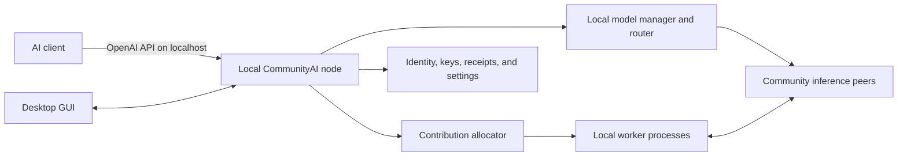

# Petals revival: inference-first plan

This repository starts from DRIFT-LLM, the most practical maintained continuation
of Petals found during the August 2026 fork audit. It preserves the parts that are
most valuable for a revival: transformer-block sharding, Hivemind DHT discovery,
fault-aware routing, heterogeneous devices, and a standard OpenAI-compatible API.

The original Petals 2.2.0 source snapshot remains separate and unchanged. The
following remotes are configured in the local revival checkout:

- `origin`: the writable [`flujo-app/CommunityAI`](https://github.com/flujo-app/CommunityAI)
  revival fork;
- `drift`: the working codebase used as our starting point;
- `upstream`: the original BigScience Petals repository;
- `nakshatra`: an active, independent llama.cpp/GGUF distributed-inference effort
  that we will track for discovery, transport, and reliability ideas.

## Current status (2026-08-22)

Milestones 1 through 4 are complete. The revival has exact cross-platform inference
parity, real multi-machine failure recovery, signed manifest and artifact integrity,
and a persistent multi-model local node with an authenticated OpenAI-compatible API,
supervised contribution workers, and measured edge behavior.

Milestone 5 is active. Its architectural foundation is now fixed:

- PySide 6 is the selected product shell; both spike alternatives passed packaged UI
  smokes on Windows, Linux, and macOS before the decision was recorded in
  [`ADR 0002`](adr/0002-desktop-shell-spike.md).
- The desktop remains a client and lifecycle supervisor of the standalone local node;
  model, DHT, and worker runtimes do not move into the GUI process.
- Privileged control credentials and revocable OpenAI client keys are separate
  authorization domains. An inference key cannot manage workers or keys, and the
  control credential cannot perform inference.

The immediate objective is to promote the shared spike client and acceptance contract
into the production PySide application, then complete native credential ownership,
onboarding and process lifecycle, contribution policies and budgets, accessibility and
resource measurements, and signed installer/update/rollback validation. Milestones 6
through 8 remain planned after this desktop foundation.

## Scope and product destination

Inference is the product. Distributed training and fine-tuning are compatibility
features, not roadmap priorities. Near-term work must make it easy for ordinary
computers to contribute model blocks and for clients to receive correct, streamed
responses.

The long-term product is one installable desktop application. A user starts the
application, points an AI client at a stable localhost OpenAI endpoint, and chooses
a community model. The application discovers the swarm, calculates and repairs its
own route, and streams the response without depending on an operator-owned gateway.
The same installation may contribute compute in the background when the user opts
in.



"One application" means one installer, one lifecycle, and one coherent GUI. It
does not require inference, networking, and GPU work to share one operating-system
process. Those components should remain supervised and isolated so that a crashed
worker cannot take down the local API or corrupt the UI.

The GUI must let a non-expert:

- create, revoke, copy, and label keys for the localhost API, and securely store
  model-provider credentials such as a Hugging Face token;
- see model availability, route health, download state, request activity, and the
  exact localhost URL and model names to give an AI client;
- enable or pause contribution, set an absolute or percentage VRAM budget, and set
  storage, bandwidth, power, schedule, and thermal limits;
- allow, prefer, or forbid models and model families. A local restriction is a hard
  constraint: automatic allocation must never override it;
- see estimated, pending, and settled contribution credits separately, including
  enough receipt detail to explain changes without exposing prompt contents; and
- understand that public workers process request-derived data and must be assumed
  capable of observing or retaining it.

Private and VPN swarms remain supported. The community network is an additional
mode, not a replacement for environments where every participant is trusted.

## Architectural baseline and gaps

The current code is decentralized within a configured model swarm, but it is not
yet an autonomous public community:

- Workers publish expiring layer announcements into a Hivemind DHT. Each client
  reads those records and chooses its own latency- or throughput-aware route. The
  bootstrap peer is an entry point, not a scheduler.
- The friendly `drift up` flow normally gives newcomers one first-node join address.
  Multiple initial peers are supported, but redundant community discovery and
  recovery from all shipped seeds being unavailable are not yet productized.
- `drift api` already binds to `127.0.0.1` by default and performs client-side swarm
  routing, but it serves one model per process and is separate from `drift up`.
- A worker operator chooses the model out of band. DRIFT automatically chooses the
  number and range of blocks within that model; it does not choose between models.
- Model DHT names are generally derived from a repository name, sometimes only its
  basename. Announcements do not bind a route to one exact repository revision,
  tokenizer, runtime profile, or weight manifest. That is unsafe for an untrusted
  multi-model public network.
- The client keeps input embeddings, final normalization, and the language-model
  head locally. This is much smaller than the full model but can still impose
  meaningful RAM, disk, download, and CPU costs on a thin edge device.
- There is no contribution-credit protocol, settlement ledger, community model
  governance, or automatic cross-model allocation today.

These gaps determine the order of the roadmap. A GUI must control a stable local
node service; it must not become the place where networking, identity, and credit
rules are improvised.

## Decentralization model

The goal is to minimize concentrated authority and eliminate central services from
the inference hot path. It is not credible to promise that a fresh installation can
discover a global network with no prior information or trust. Each installation
needs at least a trusted application build or catalog root and one reachable way to
learn about peers.

The target design is:

- **Local inference gateway.** Every application exposes its own localhost OpenAI
  endpoint and routes directly through the swarm. A hosted gateway may exist for
  convenience, but normal desktop use never depends on it.
- **Interchangeable discovery.** Ship several independently operated bootstrap and
  relay peers, accept user-supplied peers, remember previously verified peers, and
  use LAN discovery where available. Bootstrap peers introduce nodes; they do not
  select models, approve requests, hold balances, or route inference.
- **Content-addressed model identity.** Derive the swarm namespace from a canonical
  model manifest, not a mutable name. Pin full model revisions and hash the config,
  tokenizer, chat template, weight inventory, runtime compatibility, precision and
  quantization profile. A worker with a different manifest is a different swarm.
- **Local policy and worker sovereignty.** Every node independently decides whether
  and what to host inside the user's resource and model restrictions. No remote
  scheduler can allocate a user's GPU.
- **Forkable trust.** The application may subscribe to one or more signed community
  catalogs. Catalogs recommend compatible manifests; they do not prevent users from
  adding another catalog or an exact manifest. Use threshold signatures and key
  rotation so no single maintainer key can silently redefine an approved model.
- **No blockchain in routing or model selection.** The DHT is an expiring discovery
  store, not a historical ledger. It must not be treated as a balance database or a
  voting system. Blockchain is considered only if credits eventually require open,
  transferable, trustless settlement and a federated design cannot meet the threat
  model.
- **Explicit residual dependencies.** Model artifacts initially come from pinned
  Hugging Face revisions and local caches. The longer-term design should support
  content-addressed mirrors and peer-assisted distribution, but artifact delivery
  must be replaceable and its contents verified.

No single bootstrap, catalog mirror, health dashboard, hosted API, or credit node
may have unilateral control over inference. Catalog signing and credit settlement
are separate trust domains and stay off the token-generation critical path.

## Autonomous community model placement

The existing Petals/DRIFT balancing algorithm solves placement only after a model
has been chosen. Community mode needs a higher-level allocator that chooses a model
and then delegates block placement to the existing algorithm.

### Canonical model manifest

Define a versioned `ModelManifest` containing at least:

- a human-readable name and OpenAI API aliases;
- the upstream repository plus an immutable full revision;
- hashes and sizes for the configuration, tokenizer, chat template, weight index,
  and any converted or quantized artifacts;
- architecture, number of blocks, context limits, license and gated-access
  requirements;
- the supported DRIFT protocol/runtime range, tensor schema, attention behavior,
  dtype, quantization and adapter profile; and
- a manifest digest from which all DHT keys and protocol namespaces are derived.

The first protocol exchange must compare manifest digests. A client or worker must
reject a same-named peer with different weights or an incompatible execution
profile instead of merely warning about it.

### Distributed capacity and demand signals

Nodes publish signed, expiring leases describing current and intended block ranges,
measured throughput, reachable addresses, cache headroom, and bounded resource
capacity. Local routers publish coarse, short-lived demand and failure aggregates;
they never publish prompts, generated text, API keys, or per-user request histories.

Demand records are hints, not authority. The design must account for spam, Sybil
identities, dishonest throughput claims, replayed leases, and an attacker trying to
pull all volunteers toward one model. Measurements from completed routes and active
probes should carry more weight than self-reported capacity.

### Local allocation policy

Each application filters candidate manifests through hard local constraints:
model allow/deny rules, license acceptance, available accelerator support, VRAM,
storage, bandwidth, power schedule, and minimum local reserve. It then calculates a
local utility approximately shaped by:

```text
coverage deficit * observed demand * useful local throughput * reliability
--------------------------------------------------------------------------
             download + switching + energy + fragmentation cost
```

The formula is a policy input, not a network consensus value. Eligible nodes make a
weighted, node-specific randomized choice so they do not all select the same model
from the same snapshot. Before downloading weights, a node announces an expiring
intent lease. Minimum residency times, switching penalties, random jitter, cooldowns,
and hysteresis prevent oscillation and download storms. A node may partition its
budget across models only when doing so improves complete redundant routes rather
than leaving unusable fragments.

Within the selected model, the current throughput-aware contiguous block allocator
remains the starting point. It must be extended to target minimum replica counts,
queue pressure, cache capacity, geographic/network diversity, and graceful handoff
before a node abandons a scarce range.

This is how the community chooses models: compatible manifests enter catalogs,
real client demand creates pressure, and autonomous volunteers respond within their
own policies. It is not a global poll, a maintainer command, or token-weighted
governance. Different catalogs or communities may legitimately support different
model sets on the same protocol.

Before public deployment, build a deterministic simulator for thousands of nodes,
hardware profiles, model preferences, demand shifts, network partitions and churn.
Promotion requires convergence without synchronized switching, sustained end-to-end
coverage, and recovery when a popular model or region suddenly loses capacity.

## Unified local API and edge operation

The existing OpenAI-compatible server is the correct starting point for the desktop
data path. Move it behind a persistent local node daemon and evolve it into a
multi-model manager:

- expose a stable endpoint such as `http://127.0.0.1:8080/v1`, bind to loopback by
  default, generate a local key during onboarding, and require an explicit secured
  opt-in before listening on a LAN interface;
- make `/v1/models` report community models with complete usable routes separately
  from known, downloading, degraded, and unavailable models;
- honor the OpenAI request `model` field, resolve aliases to exact manifest digests,
  lazily load and cache model-specific local components, and never silently replace
  a requested model with another manifest;
- keep routing and failover local. The API process asks its own DHT view for a route
  and connects to serving peers; it does not forward prompts to a central API;
- supervise an optional local worker independently. A node may use community routes
  while contributing different blocks or a different allowed model; and
- expose a versioned, authenticated local control API for the GUI, CLI, diagnostics,
  service manager, and tests rather than letting the GUI manipulate worker processes
  directly.

"Edge device" requires a measured definition. Today the client still loads the
embeddings and language-model head. For every candidate model, publish cold-start
download, disk, peak RAM/VRAM, first-token and token-generation measurements for the
client-only path. If that is too heavy for the supported edge class, prototype an
OpenAI-only thin mode in which input embeddings and the final head/sampling stage are
addressable remote roles. Preserve the current local-logits mode for research users.
Thin mode changes privacy, trust, sampling flexibility, failure recovery and traffic,
so it requires a protocol decision and parity tests rather than being hidden inside
the GUI milestone.

## Identity, keys, accounting, and credits

The application creates a long-lived node identity on first run and stores private
material in the operating system credential store where possible. Local API keys,
community identity keys, provider tokens, catalog trust roots, and future credit
credentials are distinct key classes with separate rotation and export policies.
The GUI must not display private keys by default or write them to ordinary config
files.

Contribution accounting starts with signed usage receipts, not a cryptocurrency. A
receipt should identify the exact model manifest, session/request nonce, serving
peer, verified block range, measured block-token work, time window, and applicable
protocol version. It contains no prompt, generated text, hidden state, or raw logits.
Client and worker signatures alone do not prevent collusion, fabricated traffic, or
Sybil farming, so receipt validation must use route observations, replay protection,
rate bounds, and independent sampling or attestation where practical.

Credits have three states in the product:

- **Estimated:** local measurements that are useful immediately but not spendable;
- **Pending:** signed receipts awaiting independent validation and settlement; and
- **Settled:** accepted by the selected accounting trust model and safe to spend.

A DHT cannot securely settle scarce balances because it has no permanent ordered
history and cannot prevent rollback or double-spending. Before credits affect access,
choose and document one of these settlement models:

1. a single operator ledger, which is easiest but conflicts with the decentralization
   goal and is acceptable only for an explicitly temporary pilot;
2. a federated quorum of independently operated notaries with replicated state,
   threshold decisions, audit exports, and no single writer, which is the preferred
   design to prototype; or
3. a public blockchain or other permissionless settlement rail, only if credits must
   be transferable and trustless enough to justify its cost, privacy impact, latency,
   governance, and operational complexity.

Run shadow accounting first: create and validate receipts, show them in the GUI, and
compare them against independently measured work without granting or denying service.
Only after adversarial and privacy review may settled credits grant bounded access.
Settlement outages must not interrupt in-flight inference; offline authorization and
reconciliation behavior must be explicit and bounded.

Credits are for contribution and access accounting. They are not votes over which
model a user's machine must host, and the roadmap does not introduce mining,
proof-of-work, staking, or blockchain consensus into inference routing.

## Milestones

1. **Reproducible execution baseline — complete.** Native Windows, Linux,
   and macOS setup; local DHT smoke test; exact token parity with a stock model; CPU
   and accelerator diagnostics. Windows CPU, Linux CPU, Windows CUDA, and a native
   hosted Apple Silicon macOS run are proven on an eight-block TinyLlama swarm; the
   macOS matrix also passes the MPS block-portability checks.
2. **Real multi-machine swarm — complete.** Two or more machines, explicit block
   coverage, restart testing, disconnect recovery, and latency/throughput
   measurements. A private Fly Machines swarm has proven coverage, redundancy,
   exact parity, measurements, restart recovery, and in-generation recovery. During
   a 900-token request, the selected `4:8` Machine was killed with SIGKILL; the
   client excluded its stale route, replayed 249 cached activation tokens through
   the duplicate in bounded chunks, and completed with exact stock-model parity. A
   subsequent request confirmed that the survivor's attention cache was released.
3. **Public protocol identity and content integrity — complete.** Specify `ModelManifest v1`
   and content-derived DHT namespaces; pin exact model revisions; sign and validate
   worker identity, announcements, intent leases, and execution profiles; reject
   manifest mismatches; authenticate and encrypt transport; define key rotation and
   revocation; and preserve an explicit legacy/private namespace during migration.
   Private/VPN swarms remain the default until this milestone and the public safety
   gates pass.

   The first identity slice is implemented: the strict
   [`ModelManifest v1`](MODEL_MANIFEST_V1.md) schema has deterministic SHA-256
   identities and content-derived DHT namespaces; worker and API loading pin the
   repository revision and execution profile; clients filter mismatched DHT records;
   and both sides compare the digest during RPC setup and compute requests. Legacy
   private prefixes remain available when no manifest is supplied. The artifact
   integrity slice is also implemented: reproducible generation resolves Hub revisions
   to full commits; API and worker loading verify declared config, tokenizer, index and
   only the checkpoint shards they actually need before parsing or deserialization;
   undeclared or poisoned files fail closed; and checked-in canonical vectors pin the
   digest contract. Native Windows and a real multi-Machine Fly Linux swarm have both
   passed manifested exact-parity loading, and a poisoned Fly worker was rejected
   before it could announce blocks. The security slice is now implemented as
   specified in [`PUBLIC_SWARM_SECURITY_V1.md`](PUBLIC_SWARM_SECURITY_V1.md):
   persistent libp2p identities sign complete, expiring worker announcements;
   clients bind their manifest, execution profile, block range, revocation state,
   replay order, and RPC PeerID to that signature; manifested transport explicitly
   requires libp2p TLS 1.3; and signed intent leases, dual-signed rotation, and
   successor revocation share the same strict envelope. Interrupted artifacts resume
   into a locked private partial and are atomically promoted only after size and
   SHA-256 verification. A real Hub test resumed TinyLlama at byte 2,097,152 with
   HTTP 206, and signed Windows CPU parity plus in-generation failover passed. The
   signed Fly rerun then routed across independent `0:4` and `4:8` identities and
   passed exact parity. A hosted Apple Silicon macOS run then generated the pinned
   manifest, resumed a real Hub artifact at byte 2,097,152 with HTTP 206, served all
   eight blocks through a signed manifested identity, and matched the stock token
   output exactly. This closes the milestone's cross-platform validation gate.
4. **Unified local node and multi-model OpenAI API — complete.** Introduce the persistent node
   daemon, worker supervision, a versioned local control API, multi-model discovery
   and lazy client loading, a stable localhost OpenAI endpoint, local API-key
   lifecycle, route/coverage status, bounded concurrency, and clean shutdown. Measure
   the current client-side embedding/head cost and decide the thin-edge protocol.
   Validate compatibility with representative OpenAI clients before adding a GUI.

   The first vertical slice is implemented according to
   [`ADR 0001`](adr/0001-unified-local-node.md): `drift node` owns a stable,
   authenticated loopback API; registers one exact manifest; lazily and safely loads
   its client runtime through a thread-safe model manager; resolves manifest names,
   API aliases, and digests without fallback; reports versioned authenticated status;
   generates a persistent local key when needed; refuses accidental non-loopback
   binding; and cleans up the client route manager and DHT on shutdown. The existing
   single-model `drift api` surface now uses the same selection path and rejects a
   mismatched request model.

   The second slice adds strict secret-free
   [`NodeConfig v1`](NODE_CONFIG_V1.md), bounded
   runtime residency, request-scoped leases, least-recently-used idle eviction,
   authenticated safe unload, and coverage observations from loaded route managers.
   An HTTP cancellation cannot release or evict a runtime while its executor thread
   is still generating.

   The final slice adds artifact-free, manifest-bound coverage discovery for every
   configured model; isolated contribution-worker processes with observable restart
   backoff and authenticated start, pause, and restart controls; persistent labeled
   API-key creation, listing, relabeling, and revocation with hash-only storage; and a
   reproducible cold-client benchmark for cache growth, local embedding/head
   weights, process-tree RAM/accelerator use, load time, first-token latency, and
   decode rate. A real Fly
   swarm exposed two distinct manifests through one restarted node. The official
   OpenAI Python client listed and generated from both, streamed a completion, reused
   the persistent key after restart, and proved one-runtime LRU eviction plus exact
   stock-model token parity. Unloaded discovery observed complete `8:8` external
   routes without loading either client runtime. The measured TinyLlama CPU client
   used 16,384,000 bytes for local embedding/head parameters and 11,773,110 bytes of
   cold cache growth; this model fits the current local-logits edge design, while
   larger selectable models still require their own published measurements.
5. **Desktop application and contribution controls — in progress.** Build the selected
   PySide desktop and ship signed installers for Windows, Linux, and macOS; complete
   first-run onboarding; manage keys in native credential stores; show endpoint, model,
   route and contribution health; enforce VRAM/storage/bandwidth/power/schedule budgets;
   implement model allow/prefer/deny policy; pause safely; integrate background startup
   and updates; and clearly disclose prompt visibility. The completed implementation
   spike compared a Python-native Qt/PySide shell with a webview shell and considered
   process isolation, installer/update signing, tray and service integration,
   accessibility, bundle size, and cross-platform CI.

   **Completed foundation.** The shell comparison and its fixed acceptance criteria
   are tracked in [`ADR 0002`](adr/0002-desktop-shell-spike.md). All six clean Windows,
   Linux, and macOS package/UI-smoke jobs passed. PySide 6 is selected for product
   implementation because it has the more consistent cross-platform runtime and avoids
   pywebview's 948 MB Linux Qt bundle and additional JavaScript bridge. The pywebview
   prototype remains evidence, not a second product frontend.

   The first production security prerequisite is also complete: managed OpenAI client
   keys authorize only `/v1/*`, while a distinct privileged control credential
   authorizes only `/control/v1/*`. Headless nodes generate separate private files,
   startup rejects missing, duplicate, or overlapping control keys, and upgraded
   installations retain their existing client key while receiving a new control key.

   **Next implementation sequence.** Promote the shell-neutral node client and
   acceptance contract into a production PySide package; move the control credential
   from the private-file bridge into native OS credential stores; add first-run setup,
   single-instance behavior, node supervision, login startup, reconnect, and clean
   shutdown; enforce contribution budgets and allow/prefer/deny policy in the node rather
   than only in the GUI; then measure startup/RSS and crash isolation and complete
   keyboard/screen-reader, signed installer, upgrade, rollback, uninstall, and retained-
   data gates on all three operating systems.
6. **Decentralized discovery and autonomous allocation.** Operate multiple
   independent bootstrap and relay peers; add peer caching, user-supplied seeds and
   LAN discovery; define threshold-signed, forkable catalogs; publish privacy-safe
   demand/capacity signals; implement intent leases and the cross-model local utility
   policy; extend block balancing for demand and redundancy; and pass simulated plus
   real-swarm churn, partition, herd, downgrade and malicious-signal tests. No
   operator-owned gateway or scheduler participates in normal localhost inference.
7. **Safe public pilot and shadow credits.** Add admission and rate limits, abuse
   controls, health and coverage monitoring without a single required dashboard,
   signed accounting receipts, pending/settled UI states, contributor explanations,
   privacy review, and a documented Sybil/collusion threat model. Select and prototype
   the settlement model, but keep credits non-spendable until independent audit and
   reconciliation tests pass.
8. **Community service and redeemable contributor access.** Demonstrate redundant
   model coverage and discovery across independent operators, production SLOs,
   capacity-aware routing, bounded offline credit authorization, audited settlement,
   content-addressed artifact mirrors, and a usable thin-edge path if milestone 4
   found it necessary. At this point an ordinary user installs one application,
   selects a community model in the GUI, connects an AI client to localhost, and may
   contribute within hard local limits without choosing blocks or tracking peers.

Detailed baseline evidence and the remaining gates are recorded in
[`REVIVAL_TEST_RESULTS.md`](REVIVAL_TEST_RESULTS.md).

## Decisions that must be resolved explicitly

The following questions require written architecture decisions and prototypes; they
must not be settled accidentally by the first GUI implementation:

| Decision | Current position | Evidence required |
| --- | --- | --- |
| Desktop shell | Resolved in ADR 0002: implement the product shell in PySide 6 while preserving the standalone node boundary. | Signed installer prototypes on all three OSes, upgrade/rollback, tray/service behavior, accessibility, crash isolation, and startup/RSS measurements remain release gates. |
| Thin edge | Keep embeddings/head local where affordable; add remote ingress/egress roles only for devices that miss published budgets. | Per-model RAM/disk/latency data, token parity, logits/sampling trade-offs, privacy analysis, and failover tests. |
| Catalog governance | Threshold-signed and forkable catalogs, with trust roots selected by each installation. | Key compromise/rotation drill, rollback protection, alternative-catalog interoperability, and malicious-manifest rejection. |
| Demand signal | Coarse signed aggregates and observed route pressure, never request contents. | Sybil/spam simulation, privacy review, convergence under bursty demand, and proof that one attacker cannot trigger a network-wide download storm. |
| Credit settlement | Prototype federated notaries before considering a permissionless ledger. | Double-spend, replay, partition, collusion, privacy, audit, recovery, and sustained-outage tests with explicit trust and governance costs. |
| Artifact distribution | Start with immutable Hub revisions and verified local caches, then add interchangeable mirrors and peer-assisted delivery. | Full-hash verification, poisoned-mirror rejection, resume behavior, gated-model licensing, bandwidth limits, and origin outage tests. |

## Nakshatra relationship

Nakshatra is promising but is not a drop-in Petals fork: its active engine is a
patched llama.cpp daemon using sliced GGUF files and a gRPC chain, while its copied
`petals` package is largely historical. Its signed listings, public discovery,
transport experiments, layer-package distribution, and recovery work are useful
design references. Direct code merging is unlikely; ideas should be ported behind
small interfaces and verified against this repository's end-to-end inference path.

## Release gates

No public community release is complete unless all of these are demonstrated:

- distributed output parity against a stock reference model for every published
  execution profile;
- full block coverage with the target number of redundant, independently operated
  routes and recovery from a worker disappearing during generation;
- bounded memory, attention-cache cleanup, and graceful handoff while workers switch
  models;
- authenticated worker metadata, encrypted transport, signed expiring leases, exact
  manifest matching, rollback protection, and rejection of poisoned artifacts;
- loss of any one published bootstrap, relay, catalog mirror, health service, hosted
  API, or accounting node does not stop established inference, and a fresh app can
  join through another independent seed;
- autonomous allocation converges under modeled and real churn without herd switching
  and restores model coverage after abrupt regional or model-specific capacity loss;
- the configured contribution budget is enforced within documented runtime overhead,
  a forbidden model is never downloaded or hosted, and pausing releases resources in
  bounded time;
- the localhost endpoint passes multi-model OpenAI compatibility, streaming, auth,
  restart, upgrade and failover tests without an operator gateway;
- Windows, Linux, and macOS installers pass clean install, update, rollback and
  uninstall tests, and secrets are not left in logs or ordinary configuration files;
- the edge resource envelope is published for every selectable model, with a verified
  thin mode where the supported device class requires one;
- users receive an explicit warning that volunteer workers may observe or retain
  request-derived data, while discovery telemetry and accounting receipts contain no
  prompt or generated content;
- an automated health view can be reconstructed from signed network data and does not
  depend on a single host; and
- before credits become spendable, replay, double-spend, Sybil, collusion, partition,
  settlement-outage and reconciliation tests pass under the documented trust model.
  Accounting failure must not terminate an in-flight generation.

## Design references

The plan builds on, but is not limited to:

- the Petals work on fault-tolerant inference and automatic within-model block
  placement: [Distributed Inference and Fine-tuning of Large Language Models Over
  the Internet](https://arxiv.org/abs/2312.08361);
- Hivemind's DHT model, where any known peer can introduce another peer to a
  decentralized key-value network: [Hivemind quick start](https://github.com/learning-at-home/hivemind/blob/master/docs/user/quickstart.md);
- libp2p's replicated Kademlia records, validation hooks, expiring provider records,
  and multiple peer-discovery sources: [Kademlia DHT specification](https://github.com/libp2p/specs/blob/master/kad-dht/README.md)
  and [peer routing records](https://github.com/libp2p/specs/blob/master/RFC/0003-routing-records.md);
- immutable Hub revisions for reproducible model artifacts: [Hugging Face Hub
  downloads](https://huggingface.co/docs/huggingface_hub/guides/download); and
- threshold roles, delegation, rotation, expiry, mirrors and rollback protection as
  design input for catalogs and application updates: [The Update Framework
  specification](https://theupdateframework.github.io/specification/latest/).
